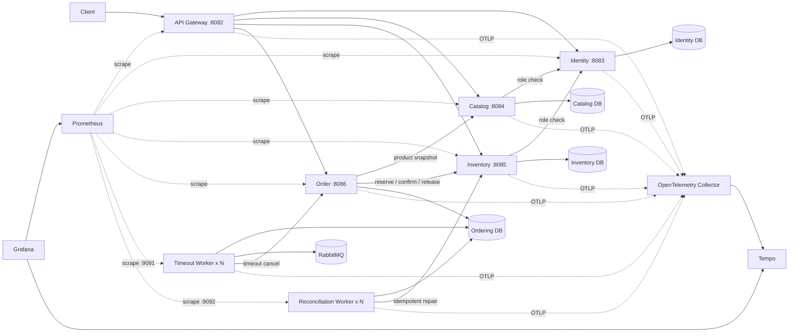

# Go Order Management Cloud-Native Lab

> 一个从 Go 分层单体持续演进而来的云原生实验项目，重点展示微服务数据边界、Inventory Reservation、Order Saga、Transactional Outbox、RabbitMQ Publisher Confirms、请求预算、有限重试、熔断、限流、自动对账、多 Worker 租约、Kubernetes 交付，以及 Prometheus、Grafana 和 OpenTelemetry 可观测性。

本仓库不是完整电商平台，也不宣称已经达到生产级云原生标准。当前已经完成：

- API Gateway、四个业务服务和两个独立 Worker；
- Identity、Catalog、Inventory、Ordering 四库数据所有权；
- Inventory Reservation、Order Saga、补偿和自动对账；
- Transactional Outbox、RabbitMQ TTL/DLX、Publisher Confirms 和多 Worker 租约；
- HTTP deadline、细分超时、有限重试、熔断和 Gateway Token Bucket 限流；
- Docker Compose 四库拓扑与完整业务 Saga；
- Kubernetes Kustomize base/local/test、Ingress/PDB 合同、kind 部署、失败 rollout 与 `rollout undo`；
- 五个 HTTP 服务和两个 Worker 的 Prometheus 指标；
- Prometheus recording rules、九条基础 alert rules 和确定性规则测试；
- 自动 Provisioning 的 Grafana Prometheus/Tempo 数据源与应用总览 Dashboard；
- OpenTelemetry SDK、W3C Trace Context、OTLP Collector、Tempo 和日志 Trace 关联；
- Observability Stack CI：完整 Saga、七 target、规则健康、Grafana API 和五服务 Trace 验收。

Alertmanager 通知、生产 SLO/错误预算、基础设施 exporter、Kubernetes 内监控/追踪栈、RabbitMQ 消息 Trace Context、HPA、NetworkPolicy、GHCR 和正式环境持续交付仍在后续阶段。

## 当前能力矩阵

| 维度 | 当前实现 |
| --- | --- |
| 运行单元 | API Gateway + Identity + Catalog + Inventory + Order + Timeout Worker + Reconciliation Worker |
| 数据边界 | `go_order_identity`、`go_order_catalog`、`go_order_inventory`、`go_order_ordering` |
| 一致性 | Inventory Reservation + Order Saga + 补偿 + 自动对账 |
| 异步可靠性 | Transactional Outbox + RabbitMQ TTL/DLX + Publisher Confirms + at-least-once |
| HTTP 可靠性 | Request ID + deadline + Transport 超时 + 有限重试 + 操作级熔断 |
| 入口保护 | Gateway 客户端/全局 Token Bucket + HTTP 429 |
| Worker 扩容 | 两类 Worker 均使用租约与 `FOR UPDATE SKIP LOCKED` |
| 数据库迁移 | 四套 Goose migration；Compose 与 Kubernetes 一次性迁移任务 |
| Compose 验证 | 四库、RabbitMQ、双类 Worker 各 2 副本、完整 Order Saga |
| Kubernetes 验证 | kind 部署、暴露面、双 Worker、失败 rollout、undo、完整 Saga |
| 指标 | HTTP server/client、Order、Outbox、Saga、Reconciliation、Worker、RabbitMQ Confirm |
| Dashboard | Grafana 文件 Provisioning，稳定 UID `go-order-overview`，16 个核心面板 |
| 规则 | 6 条 recording rules、9 条 alert rules、全部显式 `for` 窗口 |
| 分布式追踪 | W3C Trace Context + OpenTelemetry SDK + OTLP Collector + Tempo |
| Trace 验收 | 固定 Trace ID 下验证 Gateway、Identity、Catalog、Inventory、Order 和 Saga span |

## 运行拓扑



只有 API Gateway 对外提供业务入口。Prometheus、Grafana、Collector 和 Tempo 是可选观测组件，不参与业务 readiness 链路。

## 核心一致性与可靠性

### Order Saga

```text
Catalog snapshot
    ↓
create reserving Order
    ↓
Inventory reserve using stable reservation_id
    ↓
Order pending + timeout Outbox
```

- 预占失败：订单进入 `failed`；
- 本地落单失败：释放库存预占；
- 补偿结果不确定：进入 `reconciliation_required`；
- 支付：确认预占；
- 主动取消或超时：释放预占。

### Outbox 与 Worker

- `FOR UPDATE SKIP LOCKED` 领取事件或对账任务；
- `lease_owner` / `lease_until` 支持多副本和崩溃恢复；
- Broker ACK 后才将 Outbox 标记为 `published`；
- NACK、确认超时和连接异常进入可重试失败；
- 重复消息依靠幂等状态机处理，不宣称 exactly-once。

## Docker Compose

基础业务拓扑：

```bash
cp .env.example .env

docker compose config --quiet
docker compose up -d --build --wait \
  --scale order-timeout-worker=2 \
  --scale order-reconciliation-worker=2

curl --fail http://127.0.0.1:8082/readyz
sh scripts/smoke/microservices-saga.sh
```

清理：

```bash
docker compose down -v --remove-orphans
```

## Observability Stack

可观测性通过独立 overlay 加入：

```bash
docker compose -f compose.yml -f compose.observability.yml up -d --build --wait \
  --scale order-timeout-worker=2 \
  --scale order-reconciliation-worker=2
```

默认入口：

```text
Prometheus: http://127.0.0.1:9090
Grafana:    http://127.0.0.1:3000
Tempo:      http://127.0.0.1:3200
OTLP/HTTP:  http://127.0.0.1:14318
```

本地端口和 Grafana 管理员信息可通过部署环境变量覆盖。非本地环境必须使用部署系统的 Secret 机制注入凭据。

### Prometheus scrape endpoints

| 目标 | 端点 |
| --- | --- |
| API Gateway | `:8082/metrics` |
| Identity | `:8083/metrics` |
| Catalog | `:8084/metrics` |
| Inventory | `:8085/metrics` |
| Order | `:8086/metrics` |
| Timeout Worker | `:9091/metrics` |
| Reconciliation Worker | `:9092/metrics` |

### Grafana Dashboard

Dashboard UID：

```text
go-order-overview
```

覆盖 target 状态、HTTP RED 信号、内部调用、Order/Saga、Outbox、Reconciliation、RabbitMQ Publisher Confirm 和 Worker availability。

### Recording rules

```text
service:http_requests:rate5m
service:http_server_errors:rate5m
service:http_server_error_ratio:rate5m
service:http_server_request_duration_seconds:p95
service:http_client_attempts:rate5m
worker:up:max
```

### Alert rules

```text
GoOrderTargetDown
GoOrderWorkerDown
GoOrderElevatedHTTP5xxRatio
GoOrderHighP95Latency
GoOrderOutboxOverdue
GoOrderOutboxActionableAgeHigh
GoOrderReconciliationBacklog
GoOrderSagaStuck
GoOrderMetricsCollectionFailing
```

这些阈值是实验项目默认值，不是生产 SLO。当前未配置 Alertmanager receiver 或通知渠道。

## OpenTelemetry 与 Tempo

所有 HTTP 服务和 Worker 安装共享 OpenTelemetry SDK。无 OTLP exporter 时仍生成有效本地 Trace Context；配置 exporter 后通过 OTLP/HTTP 发送到 Collector，再由 Collector 转发到 Tempo。

传播标准：

```text
traceparent
tracestate
```

响应诊断头：

```text
X-Trace-ID
X-Span-ID
```

Request ID 与 Trace ID 是不同的标识：Request ID 用于应用请求预算和日志关联，Trace ID 用于跨服务调用图。

当前 span 采用有限名称：

```text
POST api_orders
GET api_products
POST internal_inventory
order.create_saga
timeout_worker.publish_batch
timeout_worker.consume
reconciliation_worker.process_batch
reconciliation_worker.process_task
```

禁止把用户 ID、订单 ID、预占 ID、请求体、Token、原始 URL、查询参数或错误文本写入 span name/attribute。

本地 Trace 验证：

```bash
export TRACE_ID=0123456789abcdef0123456789abcdef
export TRACEPARENT=00-${TRACE_ID}-0123456789abcdef-01
export TRACESTATE=goorder=local

sh scripts/smoke/microservices-saga.sh
python3 scripts/smoke/tempo-trace.py
```

当前 RabbitMQ 消息尚未携带 W3C Trace Context；消息发布和消费由 Worker 本地 span 表示。

## Kubernetes

```text
deploy/kubernetes/
├── base/
└── overlays/
    ├── local/
    └── test/
```

Local overlay 用于 kind 自动验收：

```bash
kustomize build deploy/kubernetes/overlays/local >/tmp/go-order-local.yaml
sh scripts/k8s/deploy-local.sh
sh scripts/smoke/microservices-saga-kubernetes.sh
```

Test overlay 提供七个应用运行单元 2 副本、七个 `minAvailable: 1` PDB、一个 `nginx` Gateway Ingress、默认主机名 `go-order.test.local` 和内部 ClusterIP 边界。

Kubernetes base 已提供 Prometheus scrape annotations 和 Worker metrics ports；仓库尚未在 Kubernetes 内安装 Prometheus、Grafana、Collector、Tempo 或对应 Operator。

## CI 质量门禁

### 主 CI

```text
golangci-lint
go test ./...
go test -race ./...
go vet ./...
go build ./...
迁移校验与 7 个二进制构建
镜像、四库、RabbitMQ、双类 Worker
完整 Compose Saga
真实 kind 部署、失败 rollout、undo、Kubernetes Saga
```

### Kubernetes Contracts

```text
local/test overlay 渲染
Ingress、PDB、副本和 Service 边界
Prometheus annotations 与 Worker metrics ports
```

### Observability Stack

```text
Compose overlay 合同
Dashboard/Provisioning/Cardinality 静态检查
promtool check config 与规则夹具
完整应用 + Prometheus + Grafana + Collector + Tempo
完整 Order Saga with W3C context
七 target、规则健康与 recording series
Grafana Prometheus/Tempo datasource 与 Dashboard API
Tempo 五服务跨服务 Trace、Saga span 和有界 span name
```

## 文档入口

- [文档导航](docs/README.md)
- [微服务数据所有权与 Order Saga](docs/architecture/microservices-v2-data-ownership.md)
- [Outbox 租约与 Publisher Confirms](docs/architecture/migrations-outbox-leasing.md)
- [HTTP 请求预算与有限重试](docs/architecture/http-timeout-retry.md)
- [熔断与 Gateway 限流](docs/architecture/circuit-breaker-rate-limit.md)
- [自动 Order 对账 Worker](docs/architecture/reconciliation-worker.md)
- [Kubernetes 基础与运行验收](docs/architecture/kubernetes-foundation.md)
- [Prometheus 指标基础](docs/architecture/prometheus-metrics.md)
- [Grafana Dashboard 与告警规则](docs/architecture/grafana-alerts.md)
- [OpenTelemetry 分布式追踪](docs/architecture/opentelemetry-tracing.md)
- [云原生完成度与缺口](docs/architecture/cloud-native-status.md)
- [项目演进记录](docs/project_evolution.md)

## 当前边界

已经完成：

- 微服务、独立数据所有权、Reservation、Saga、Outbox 和 Publisher Confirms；
- 请求预算、有限重试、熔断、限流和自动对账；
- Compose 与 Kubernetes 双环境完整 Saga；
- Kubernetes base/local/test、Ingress/PDB、kind 部署和回滚；
- Prometheus 应用指标、七 target 抓取、recording/alert rules；
- Grafana 自动数据源、Dashboard 和可重复 API 验收；
- OpenTelemetry SDK、W3C HTTP 传播、OTLP Collector、Tempo、日志关联和跨服务 Trace 验收。

尚未完成：

- RabbitMQ 消息级 Trace Context 传播；
- Alertmanager 通知、生产 SLO/错误预算、tail sampling 和生产 Trace retention；
- RabbitMQ consumer 细粒度计数与基础设施 exporter；
- Kubernetes 内可观测性栈、HPA、NetworkPolicy 和多节点故障；
- GHCR、测试环境持续部署和不可变版本推广；
- 最小权限账号、mTLS/Workload Identity；
- 备份恢复、Runbook、压测和故障演练。

> **当前已完成微服务可靠性、Kubernetes 基础交付，以及 Prometheus/Grafana/OpenTelemetry 应用级可观测性；仍未达到生产级云原生交付状态。**
