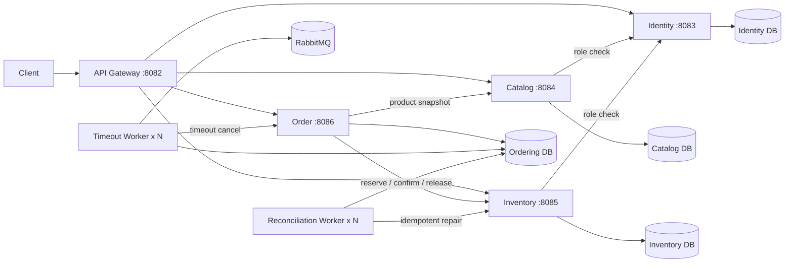

# Go Order Management Cloud-Native Lab

> 一个从 Go 分层单体持续演进而来的云原生实验项目，重点展示微服务数据边界、Inventory Reservation、Order Saga、Transactional Outbox、RabbitMQ Publisher Confirms、请求预算、有限重试、熔断、限流、自动对账、多 Worker 租约，以及 Docker Compose 与 Kubernetes 的分阶段交付。

本仓库不是完整电商平台，也不宣称已经达到生产级云原生标准。当前已经完成：

- 微服务核心改造与四库数据所有权；
- 应用可靠性收口；
- Compose 完整业务验证；
- Kubernetes Kustomize base、local 和 test overlays；
- kind 实际部署、失败版本检测、`rollout undo` 和完整 Kubernetes Saga；
- Gateway Ingress 合同与多副本工作负载 PodDisruptionBudget；
- local/test overlay 的独立 CI 契约验证。

HPA、NetworkPolicy、多节点故障行为、Prometheus/Grafana、OpenTelemetry、GHCR 和正式环境持续交付仍在后续阶段。

## 当前能力矩阵

| 维度 | 当前实现 |
| --- | --- |
| 运行单元 | API Gateway + Identity + Catalog + Inventory + Order + Timeout Worker + Reconciliation Worker |
| 数据边界 | `go_order_identity`、`go_order_catalog`、`go_order_inventory`、`go_order_ordering` |
| 一致性 | Inventory Reservation + Order Saga + 补偿 + 自动对账 |
| 异步可靠性 | Transactional Outbox + RabbitMQ TTL/DLX + Publisher Confirms + 至少一次投递 |
| HTTP 可靠性 | Request ID + deadline + Transport 超时 + 有限重试 + 操作级熔断 |
| 入口保护 | Gateway 客户端/全局 Token Bucket + HTTP 429 |
| Worker 扩容 | Timeout/Reconciliation Worker 均使用租约与 `FOR UPDATE SKIP LOCKED` |
| 数据库迁移 | 四套独立 Goose migration；Compose 和 Kubernetes 均使用一次性迁移任务 |
| Compose 验证 | 四库、RabbitMQ、2 个 Timeout Worker、2 个 Reconciliation Worker、完整 Saga |
| Kubernetes 清单 | base + local/test overlays、StatefulSet、Deployment、Service、Migration Job、ConfigMap/Secret、Ingress、PDB |
| Kubernetes 运行验证 | CI 创建真实 kind 集群，验证部署、暴露面、双 Worker、失败 rollout、`rollout undo` 和完整 Saga |
| Kubernetes 契约验证 | CI 渲染 local/test overlays，并检查 Ingress、PDB、副本数和 Service 暴露边界 |

## 运行拓扑



只有 API Gateway 对外提供业务入口；业务服务、数据库、RabbitMQ 和 Worker 保持内部通信。

## 核心可靠性设计

### Order Saga

```text
Catalog snapshot
    ↓
create reserving Order
    ↓
Inventory reserve using stable reservation_id
    ↓
Order pending + timeout Outbox
```

- 库存预占失败：订单转为 `failed`；
- 本地落单失败：释放库存预占；
- 补偿结果不确定：进入 `reconciliation_required`；
- 支付：确认预占；
- 主动取消或超时：释放预占。

### Outbox 与 Timeout Worker

- `FOR UPDATE SKIP LOCKED` 领取事件；
- `lease_owner` / `lease_until` 支持多副本和崩溃恢复；
- Broker ACK 后才将 Outbox 标记为 `published`；
- NACK、确认超时和连接异常进入可重试失败；
- 保持 at-least-once，消费者依靠幂等状态机处理重复消息。

### 自动对账

Ordering 数据库维护结构化 `order_reconciliation_tasks`。Reconciliation Worker：

- 多副本租约领取；
- 复用 HTTP deadline、有限重试和熔断；
- 执行幂等 confirm/release；
- 未知动作保持 `unresolved`；
- 支持真正只读的 dry-run 预演。

```bash
docker compose run --rm \
  -e RECONCILIATION_DRY_RUN=true \
  order-reconciliation-worker
```

## Docker Compose 运行

依赖：Docker、Docker Compose v2。

```bash
cp .env.example .env

docker compose config --quiet
docker compose up -d --build --wait \
  --scale order-timeout-worker=2 \
  --scale order-reconciliation-worker=2

curl --fail http://127.0.0.1:8082/readyz
```

完整业务冒烟：

```bash
sh scripts/smoke/microservices-saga.sh
```

清理：

```bash
docker compose down -v --remove-orphans
```

## Kubernetes 运行与验证

目录：

```text
deploy/kubernetes/
├── base/
│   ├── namespace.yaml
│   ├── configmap.yaml
│   ├── infrastructure.yaml
│   ├── migrations.yaml
│   ├── applications.yaml
│   └── kustomization.yaml
└── overlays/
    ├── local/
    │   ├── gateway-nodeport.yaml
    │   ├── fast-timeout-config.yaml
    │   ├── kind-config.yaml
    │   └── kustomization.yaml
    └── test/
        ├── ingress.yaml
        ├── pod-disruption-budgets.yaml
        ├── README.md
        └── kustomization.yaml
```

### Local overlay

用于 kind 自动验收：

- Gateway NodePort；
- 本地开发 Secret；
- 两个 Timeout Worker；
- 两个 Reconciliation Worker；
- 可重复的失败 rollout 与 `rollout undo`；
- 完整 Kubernetes Saga。

渲染：

```bash
kustomize build deploy/kubernetes/overlays/local >/tmp/go-order-local.yaml
```

本地 kind 部署：

```bash
sh scripts/k8s/deploy-local.sh
```

Kubernetes Saga：

```bash
sh scripts/smoke/microservices-saga-kubernetes.sh
```

### Test overlay

用于非生产测试环境的交付合同：

- API Gateway、四个业务服务和两个 Worker 类型均为 2 副本；
- 七个 PDB，均为 `minAvailable: 1`；
- 一个 `nginx` Ingress；
- 默认测试主机名 `go-order.test.local`；
- MySQL、RabbitMQ 和业务 Service 保持 ClusterIP；
- Secret 值仅为占位符，部署系统必须替换。

渲染：

```bash
kustomize build deploy/kubernetes/overlays/test >/tmp/go-order-test.yaml
```

Test overlay 不负责安装 Ingress Controller。目标集群必须提供 `nginx` ingress class，并将 `go-order.test.local` 解析到 Ingress 地址。

## CI 质量门禁

GitHub Actions 包含三条验证职责。

### Go 与 Compose

```text
golangci-lint
go test ./...
go test -race ./...
go vet ./...
go build ./...
旧单体与四套服务 migration validate
7 个服务/Worker 二进制构建
Docker Compose 配置与镜像
四库与 RabbitMQ
2 个 Timeout Worker
2 个 Reconciliation Worker
Gateway readiness
完整 Compose Order Saga
```

### kind Runtime

```text
创建 disposable kind 集群
构建并加载 7 个应用镜像
应用 Kustomize local overlay
等待 2 个 StatefulSet
等待 4 个 Migration Job
等待 7 个 Deployment
验证内部/外部 Service 边界
验证双类 Worker 副本
失败 rollout 检测
kubectl rollout undo
完整 Kubernetes Order Saga
失败诊断与集群清理
```

### Kubernetes Contracts

```text
渲染 local overlay
渲染 test overlay
验证 test overlay 仅有一个 Gateway Ingress
验证七个 PDB
验证七个 Deployment 为 2 副本
验证 test overlay 不包含 NodePort
验证 MySQL/RabbitMQ 没有被错误应用 PDB
上传渲染后的 YAML 工件
```

## 项目结构

```text
cmd/                         服务和 Worker 入口
internal/catalogsvc/         Catalog 领域
internal/inventorysvc/       Inventory 领域
internal/ordersvc/           Order、Outbox、Saga、对账
internal/platform/           HTTP 可靠性、内部认证等公共能力
migrations/                  单体历史迁移与四套服务迁移
deploy/docker/               通用服务镜像
deploy/kubernetes/           Kustomize base 与 overlays
scripts/smoke/               Compose/Kubernetes 业务冒烟
scripts/k8s/                 Kubernetes 本地部署
docs/                        当前架构、历史基线和验证资料
```

## 文档入口

- [文档导航](docs/README.md)
- [微服务数据所有权与 Order Saga](docs/architecture/microservices-v2-data-ownership.md)
- [Outbox 租约与 Publisher Confirms](docs/architecture/migrations-outbox-leasing.md)
- [HTTP 请求预算与有限重试](docs/architecture/http-timeout-retry.md)
- [熔断与 Gateway 限流](docs/architecture/circuit-breaker-rate-limit.md)
- [Outbox/Saga 运行指标](docs/architecture/reliability-indicators.md)
- [自动 Order 对账 Worker](docs/architecture/reconciliation-worker.md)
- [Kubernetes 基础与运行验收](docs/architecture/kubernetes-foundation.md)
- [云原生完成度与缺口](docs/architecture/cloud-native-status.md)
- [项目演进记录](docs/project_evolution.md)

## 当前边界

已经完成：

- 微服务进程、容器和独立数据所有权；
- Reservation、Saga、Outbox、Publisher Confirms；
- 请求预算、有限重试、熔断和 Gateway 限流；
- 运行指标、自动对账和 dry-run；
- Compose 四库、四个 Worker 副本和完整 Saga；
- Kubernetes Kustomize base/local/test overlays；
- 真实 kind 部署、失败 rollout 恢复和完整 Saga；
- Gateway Ingress 合同和多副本 PDB；
- local/test overlay 自动契约验证。

尚未完成：

- HPA、NetworkPolicy 和多节点故障行为；
- Ingress Controller 的仓库内安装与真实 Ingress 流量验收；
- 不可变 Registry 镜像与正式环境 overlay；
- Prometheus、Grafana、OpenTelemetry 和正式告警；
- GHCR 与测试环境持续部署；
- 最小权限账号、mTLS/Workload Identity；
- 备份恢复、Runbook、压测和故障演练。

> **当前已完成应用可靠性收口和 Kubernetes 基础交付合同；仍未达到生产级云原生交付状态。**
