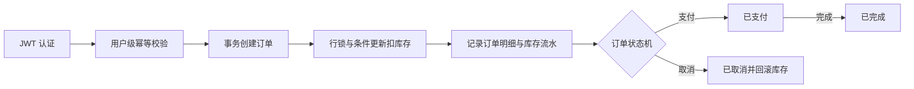

# Go 订单库存管理系统

> 带认证、库存扣减、订单状态机和幂等控制的 Go 订单库存管理系统

这是一个面向 Go 后端求职展示的业务项目。系统围绕“用户登录后提交订单”这一主链路，解决重复请求、并发扣库存、跨用户数据访问和非法订单状态流转等真实工程问题，并提供 React 管理台用于完整演示。

## 核心业务闭环



| 核心能力 | 实现方式 | 解决的问题 |
| --- | --- | --- |
| 认证与数据隔离 | HS256 JWT、Gin 中间件、订单查询强制携带 `user_id` | 未认证访问和跨用户读取、修改订单 |
| 库存一致性 | MySQL 事务、`SELECT ... FOR UPDATE`、带库存下限的条件更新、库存流水 | 超卖、部分扣减和库存变化不可追踪 |
| 订单状态机 | 条件状态更新，只允许待支付→已支付→已完成或待支付→已取消 | 重复操作和非法状态跳转 |
| 创建订单幂等 | `(user_id, idempotency_key)` 唯一索引、SHA-256 请求摘要、幂等记录与订单同事务 | 网络重试或重复点击导致重复订单、重复扣库存 |

项目演示、简历写法和面试讲解见 [docs/interview_guide.md](docs/interview_guide.md)。

## 1. 项目简介

本项目基于 Go + Gin + GORM + MySQL + Redis 实现，提供 JWT 注册登录、用户资料、商品管理、库存管理、库存流水、用户级幂等订单创建、订单状态流转和商品详情缓存等能力。

项目的目标不是堆功能，而是把常见后端工程能力做扎实：

- 清晰的 handler / service / dao / model 分层
- 统一请求参数校验和响应结构
- 使用事务保证订单创建和库存扣减一致
- 使用用户级唯一幂等 Key 和请求摘要避免重复创建订单
- 使用 JWT 中间件认证用户，并在 DAO 查询条件中隔离用户订单
- 使用库存流水追踪每一次库存变化
- 使用订单状态机限制非法状态流转
- 通过文档和测试清单支撑项目复盘

### 工程化能力

- HTTP Server 设置 ReadTimeout、WriteTimeout、IdleTimeout、ReadHeaderTimeout 和 MaxHeaderBytes
- MySQL 初始化时配置连接池：MaxOpenConns、MaxIdleConns、ConnMaxLifetime、ConnMaxIdleTime
- 启动时使用 PingContext 检查 MySQL 连通性
- 请求层使用 Request ID、Access Log 和 Recovery；HTTP Server 外层强制请求超时，向下游传递 deadline，超时返回 `503 / 5002` 并隔离后续响应写入
- Redis 不可用时商品详情缓存自动降级，不影响主流程
- CI 覆盖 go test、go test -race、go vet、golangci-lint、goose validate 和 go build
- Dockerfile 使用多阶段构建和非 root 用户运行应用
- Docker Compose 编排应用、MySQL 和 Redis，并通过健康检查控制依赖启动顺序
- Goose 管理数据库版本，Makefile 统一封装开发、测试、Docker 和迁移命令

## 2. 技术栈

- Go 1.25.7
- Gin + GORM
- MySQL 8.4 + Redis 7.2
- React 19 + TypeScript + Vite
- TanStack Router / Query + Axios + Zustand
- Tailwind CSS + Shadcn UI
- Goose 数据库迁移
- YAML + godotenv 配置
- Docker + Docker Compose
- golangci-lint + GitHub Actions

## 3. 当前实现进度

已完成：

- 商品创建、查询、上下架
- 库存初始化、增加、查询
- 库存流水记录
- 创建订单时扣减库存
- 创建订单 idempotency_key 幂等控制
- 库存不足时事务回滚
- 订单支付、完成、取消
- 取消待支付订单时回滚库存
- 订单状态机限制非法流转
- 商品详情 Redis cache-aside 缓存
- 商品上架 / 下架时删除缓存
- Redis 不可用时不影响主流程
- 并发下单防超卖和多商品事务回滚测试
- 用户注册、登录、个人信息和修改密码
- JWT 鉴权以及当前用户订单的数据隔离
- React 管理台已接入商品、库存、库存流水、订单和用户资料接口
- 登录用户昵称在侧边栏与顶部菜单中动态展示

未实现，作为后续演进：

- 除健康检查外的 handler 业务接口测试、DAO 层测试与更完整的异常分支覆盖
- 管理员角色与商品、库存操作的 RBAC 授权

## 4. 核心功能

### 商品模块

- 创建商品
- 查询商品列表
- 查询商品详情
- 商品上架
- 商品下架

### 库存模块

- 初始化商品库存
- 增加商品库存
- 查询商品库存
- 记录库存变更流水

### 订单模块

- 使用 `idempotency_key` 幂等创建订单
- 查询订单列表
- 查询订单详情
- 支付订单
- 完成订单
- 取消订单
- 取消订单时回滚库存
- 所有订单读写只允许访问当前登录用户的数据

### 用户与鉴权模块

- 用户注册、登录和个人信息查询
- 修改昵称和密码
- HS256 JWT 签发、过期校验和 Bearer 鉴权
- 除健康检查、注册和登录外，所有业务接口统一要求 JWT
- 未登录订单请求返回 401，跨用户订单访问按不存在处理并返回 404
- 前端支持注册、登录、查询当前用户、修改昵称和修改密码
- GitHub、Facebook 等第三方登录入口暂时隐藏，后端尚未实现 OAuth

### 前端管理台

- 业务仪表盘展示后端健康状态、商品、订单和库存流水摘要
- 商品页面覆盖创建、列表、详情、上架和下架
- 库存页面覆盖初始化、增加和按商品查询库存
- 订单页面覆盖创建、列表、详情、支付、完成和取消
- Profile / Account 页面分别对接昵称修改和密码修改

### Redis缓存

- 商品详情缓存 cache-aside 
- 商品上架 / 下架时删除商品详情缓存

## 5. 项目结构

```text
.github/workflows/ci.yml  持续集成配置
cmd/                      项目启动入口
config/                   YAML 加载、环境变量覆盖和配置校验
docs/                     设计文档、REST Client 请求和验证证据
internal/apperror/        业务错误定义与错误码映射
internal/app/             依赖装配、HTTP Server 和优雅退出
internal/auth/            JWT 签发、校验和认证上下文
internal/bizcache/        Redis 业务缓存
internal/dao/             数据库访问层
internal/handler/         HTTP 接口层
internal/middleware/      请求 ID、日志、超时和恢复中间件
internal/model/           GORM 数据模型
internal/request/         请求参数和校验规则
internal/response/        统一响应结构
internal/service/         业务规则、状态机和事务
fronted/                  React 管理台、认证状态和后端 API 适配层
migrations/               Goose SQL 迁移
pkg/database/             MySQL 初始化与连接池
pkg/redis/                Redis 客户端初始化
router/                   路由注册
compose.yml               应用、MySQL、Redis 编排
Dockerfile                应用镜像多阶段构建
Makefile                  开发、测试、Docker 和迁移命令入口
```

## 6. 分层说明

项目采用简单的企业后端分层方式：

- handler：负责 HTTP 请求处理、参数绑定、错误映射和统一响应
- service：负责业务规则、状态流转、事务控制和跨表操作
- dao：负责数据库 CRUD、条件查询和条件更新
- model：负责数据库表结构映射
- request：负责接口入参结构和校验规则
- response：负责接口响应结构
- bizcache：负责业务缓存读写、缓存 key 规则和缓存失效
- apperror：负责业务错误定义、错误码和错误信息封装

核心原则：handler 不写业务规则，service 不直接拼 HTTP 响应，dao 不处理业务状态。

## 7. 数据表设计

当前核心表：

- users：用户表
- products：商品表
- product_inventories：商品库存表
- stock_logs：库存流水表
- orders：订单主表
- order_items：订单明细表
- order_idempotency_keys：订单创建幂等记录表

关键设计点：

- 商品价格使用 price_fen，单位为分，避免浮点精度问题
- 商品创建后默认下架，避免未准备库存的商品直接下单
- product_inventories 通过 product_id 唯一索引保证一个商品只有一条库存记录
- stock_logs 记录 before_quantity、change_quantity、after_quantity，便于追踪库存变化
- orders 使用状态机控制待支付、已支付、已完成、已取消
- order_items 保存下单时的商品名称和价格快照
- orders 通过 user_id 关联订单所有者，所有查询和状态更新同时匹配 user_id
- order_idempotency_keys 通过 `(user_id, idempotency_key)` 唯一索引仲裁并发请求，并通过 request_hash 检测 Key 复用冲突

详细表结构见：[docs/table_design.md](docs/table_design.md)

## 8. 核心业务规则

### 商品规则

- 商品名称不能为空
- 商品价格 price_fen 必须大于 0
- 商品创建后默认下架，status = 2
- 商品上架后 status = 1
- 商品下架后 status = 2
- 查询商品时，默认查询下架的商品, status = 2

### 库存规则

- 初始化库存前商品必须存在
- 一个商品只能初始化一次库存
- 增加库存前库存记录必须存在
- 库存变更必须写入 stock_logs
- 库存流水 biz_type：1 初始化库存，2 手动入库，3 订单扣减，4 取消订单回滚

### 订单规则

- 创建订单、查询订单和订单状态变更必须携带有效 JWT
- 创建订单时 idempotency_key 必填且长度不能超过 128
- 同一用户下相同 idempotency_key 和相同请求返回原订单，相同 Key 和不同请求返回冲突
- 不同用户可以安全使用相同 idempotency_key
- 创建订单时 items 不能为空
- 下单商品必须存在且已上架
- 商品库存必须存在且充足
- 幂等记录、创建订单、扣减库存、创建订单项、写库存流水必须在同一个事务内完成
- 取消待支付订单时需要回滚库存

### Redis 缓存规则

- 查询商品详情时，设置商品缓存
- 上架/下架 商品时，删除商品缓存

详细规则见：[docs/business_rules.md](docs/business_rules.md)

## 9. 订单创建事务设计

当前项目在订单创建与取消场景中，使用数据库事务保证幂等记录、订单、订单项、库存和库存流水一致性，并通过库存行级锁控制并发扣减。

### 订单创建

订单创建流程

- 计算规范化请求摘要，并通过唯一 idempotency_key 抢占创建权
- 通过 UUID 生成 orderNo，并创建订单
- 遍历订单商品项
- 对每个商品库存记录使用行级锁（`FOR UPDATE`）读取并计算调整前后库存
- 减去需要扣减的商品库存
- 创建订单明细 order_items
- 创建并记录商品库存调整流水
- 创建完成后关联幂等记录与 order_id；相同请求重放时返回原订单
- 任一步骤失败时，幂等记录和订单事务整体回滚，避免出现部分写入

### 订单取消

订单取消流程

- 查询需要取消的订单
- 判断订单状态，仅允许取消待支付订单；已取消订单按幂等直接返回
- 查询订单下已订购的商品
- 遍历订单商品项，并回滚商品库存
- 创建并记录商品库存调整流水
- 任一步骤失败时，事务整体回滚，避免库存回滚不完整


## 10. 订单状态机

订单状态：

- 1：待支付
- 2：已支付
- 3：已完成
- 4：已取消

允许的状态流转：

- 待支付 -> 已支付
- 已支付 -> 已完成
- 待支付 -> 已取消

禁止的状态流转：

- 已支付订单不能取消
- 已完成订单不能取消
- 已取消订单不能支付或完成
- 未支付订单不能完成

## 11. Redis 商品详情缓存设计

当前项目对商品详情接口增加了 cache-aside 缓存。

### 缓存 key

```text
product:detail:{product_id}
```

### 查询流程

- 查询商品详情时，优先读取 Redis

- 如果 Redis 命中，直接返回缓存数据

- 如果 Redis 未命中，查询 MySQL

- MySQL 查询成功后，将商品详情写入 Redis

- Redis 不可用时，不影响 MySQL 主流程

### 缓存删除

- 商品状态变化时删除缓存：

- 商品上架：删除商品详情缓存

- 商品下架：删除商品详情缓存

### 当前边界

- 当前仅对商品详情接口实现 cache-aside 缓存
- 当前通过“状态变更时主动删缓存”保证基础一致性，不包含延迟双删等增强策略
- 当前未引入缓存击穿保护（如互斥锁、逻辑过期），后续可按流量特征演进
- Redis 不可用时直接降级到 MySQL 主流程，优先保证业务可用性


## 12. 幂等设计说明

创建订单要求客户端提交 `idempotency_key`，长度不超过 128。服务端对规范化后的订单项计算 SHA-256 请求摘要，并依赖 `order_idempotency_keys(user_id, idempotency_key)` 复合唯一索引完成用户级并发仲裁。

请求示例：

```json
{
  "idempotency_key": "order-create-20260627-001",
  "items": [
    {
      "product_id": 1,
      "quantity": 2
    }
  ]
}
```

- 首次请求获得创建权，在同一事务中创建幂等记录、订单、订单项、库存扣减和库存流水
- 相同 Key 且请求摘要相同：返回已创建的原订单，不重复扣减库存
- 相同 Key 但请求摘要不同：返回 HTTP 409 幂等冲突
- 创建失败：幂等记录随事务回滚，客户端可以使用原 Key 重试
- 多个并发请求使用相同 Key：数据库只允许一个请求创建订单，其余请求返回同一订单

幂等记录状态：`1` 表示创建中，`2` 表示已创建。创建完成后记录关联 `order_id`；事务失败时幂等记录同步回滚。

增加库存、支付订单和完成订单当前仍不使用请求级幂等 Key；重复调用由各自业务状态规则处理。

## 13. 接口清单

接口说明详见：[docs/api_list.md](docs/api_list.md)

## 14. 配置与环境变量

应用启动时先加载 `.env`，再读取 [config.yml](config.yml)。环境变量会覆盖 YAML 中适合按环境变化的连接配置。

### 14.1 基础环境变量

```env
MYSQL_PASSWORD=your-password
JWT_SECRET=至少32个随机字符
JWT_EXPIRE_HOURS=24
REDIS_PASSWORD=
```

- `MYSQL_PASSWORD`：必填，应用、Docker Compose 和 Goose 共用。
- `JWT_SECRET`：必填，用于 HS256 签名，至少 32 个字符，不能提交真实值。
- `JWT_EXPIRE_HOURS`：可选，覆盖 JWT 有效期，默认 24 小时。
- `REDIS_PASSWORD`：可选；当前 Compose 中的 Redis 未启用密码认证，保持为空即可。
- 不要提交真实的 `.env`，可从 [.env.example](.env.example) 复制后修改。

### 14.2 YAML 配置覆盖

| 环境变量 | 覆盖的配置 |
| --- | --- |
| `APP_PORT` | `server.port` |
| `DB_HOST` | `mysql.host` |
| `DB_PORT` | `mysql.port` |
| `DB_USER` | `mysql.user` |
| `DB_NAME` | `mysql.database` |
| `REDIS_ADDR` | `redis.addr` |
| `REDIS_DB` | `redis.db` |
| `JWT_EXPIRE_HOURS` | `jwt.expireHours` |

本地运行默认连接 `127.0.0.1:3306` 和 `127.0.0.1:6379`。Compose 会为应用容器设置 `mysql:3306` 和 `redis:6379`，无需修改 `config.yml`。

## 15. 启动方式

### 15.1 前置依赖

- Go 1.25.7
- GNU Make
- Docker 与 Docker Compose
- Goose v3.27.1

```bash
go mod download
go install github.com/pressly/goose/v3/cmd/goose@v3.27.1
```

### 15.2 本地运行应用

PowerShell 示例：

```powershell
Copy-Item .env.example .env
$env:MYSQL_PASSWORD = "your-password"
$env:JWT_SECRET = "replace-with-at-least-32-random-characters"

make infra-up
make migrate-up
make run
```

首次启动必须执行 `make migrate-up` 建表；`00007` 至 `00009` 创建用户表并加入订单归属。之后可用 `make dev` 启动 MySQL、Redis 并运行应用。

### 15.3 Docker 运行完整服务

```powershell
$env:MYSQL_PASSWORD = "your-password"
$env:JWT_SECRET = "replace-with-at-least-32-random-characters"

make docker-up
```

`make docker-up` 会先等待 MySQL 健康，再由独立 migrate 容器使用镜像内预编译的 Goose 执行迁移，迁移成功后才启动应用；容器启动不依赖在线下载迁移工具。MySQL 和 Redis 的宿主端口可通过 `MYSQL_HOST_PORT`、`REDIS_HOST_PORT` 调整。

常用 Docker 命令：

| 命令 | 作用 |
| --- | --- |
| `make compose-config` | 校验 Compose 配置 |
| `make infra-up` | 仅启动 MySQL 和 Redis，并等待健康 |
| `make infra-down` | 停止 Compose 项目 |
| `make docker-build` | 构建应用镜像 |
| `make docker-up` | 构建并启动应用、MySQL、Redis |
| `make docker-down` | 停止并移除容器，保留数据卷 |
| `make docker-ps` | 查看服务状态 |
| `make docker-logs` | 持续查看全部服务日志 |

常用迁移命令：

| 命令 | 作用 |
| --- | --- |
| `make migrate-validate` | 静态校验迁移文件 |
| `make migrate-status` | 查看数据库迁移状态 |
| `make migrate-up` | 执行全部待处理迁移 |
| `make migrate-up-one` | 只执行下一条迁移 |
| `make migrate-up-to VERSION=5` | 迁移到指定版本 |
| `make migrate-down` | 回滚最近一条迁移 |
| `make migrate-down-to VERSION=3` | 回滚到指定版本 |
| `make migrate-redo` | 重做最近一条迁移 |
| `make migrate-create NAME=add_sku` | 创建顺序编号的 SQL 迁移 |

默认访问地址为 `http://localhost:8082`，健康检查接口为：

```bash
curl http://localhost:8082/ping
curl http://localhost:8082/live
curl http://localhost:8082/readyz
```

- `/ping`：基础连通性检查
- `/live`：进程存活检查
- `/readyz`：数据库就绪检查

### 15.4 本地运行前端

```powershell
Set-Location fronted
npm install
npm run dev
```

前端默认运行在 `http://127.0.0.1:8880`，Vite 会把 `/api` 和 `/ping` 代理到 `http://localhost:8082`。生产环境建议通过同源反向代理暴露后端；可使用 `VITE_API_BASE_URL` 修改 API 根路径，默认值为 `/api/v1`。跨域直连需要后端额外配置 CORS。

## 16. 测试方式

service 测试会清理所连接数据库中的业务表。必须使用独立测试库，禁止将 `DB_NAME` 指向含有开发数据或生产数据的数据库。

### 16.1 自动化测试覆盖现状

| 测试项 | 当前状态 | 检查结论 |
| --- | --- | --- |
| 核心业务测试 | 已有 | `internal/service/*_test.go` 覆盖商品、库存、订单创建、状态机和关键异常分支 |
| 并发防超卖测试 | 已有 | `TestOrder_ConcurrentTesting_OrderOversold` 和多数量并发测试校验成功数、失败数、最终库存和库存流水 |
| 多商品事务回滚测试 | 已有 | `TestCreateOrder_MultipleItemsSecondInsufficient_Rollback` 验证第二件商品失败时前序扣减和订单数据全部回滚 |
| 创建订单幂等测试 | 已有 | 覆盖同 Key 重放、不同请求冲突、并发同 Key 只创建一单、失败回滚后重试和空 Key |
| 订单状态并发测试 | 已有 | 覆盖并发支付、并发取消以及支付与取消竞争 |

假设已创建 `go_order_inventory_test`：

```powershell
$env:MYSQL_TEST_PASSWORD = "your-password"
$env:MYSQL_TEST_DATABASE = "go_order_inventory_test"

make test-service
```

常用测试和质量命令：

| 命令 | 作用 |
| --- | --- |
| `make test` | 运行全部 Go 测试 |
| `make test-service` | 设置 `RUN_MYSQL_TEST=1` 并运行 MySQL service 集成测试 |
| `make test-redis` | 运行 Redis 集成测试 |
| `make test-all` | 运行普通测试、MySQL service 测试和 Redis 集成测试 |
| `make test-race` | 使用 race detector 运行普通测试；集成测试需要额外设置对应环境变量 |
| `make coverage` | 生成 `coverage.out` |
| `make coverage-html` | 生成 `coverage.html` |
| `make check` | 执行格式化、模块校验、vet 和测试 |

Redis 集成测试前需保证 Redis 已启动，可先执行 `make infra-up`。

手动接口测试文件位于 [docs/http](docs/http)，完整业务链路见 [docs/http/demo_flow.http](docs/http/demo_flow.http)。测试计划见 [docs/test_plan.md](docs/test_plan.md)。

## 17. 项目文档

- [docs/api_list.md](docs/api_list.md)：接口清单
- [docs/business_rules.md](docs/business_rules.md)：业务规则
- [docs/table_design.md](docs/table_design.md)：数据表设计
- [docs/test_plan.md](docs/test_plan.md)：测试计划
- [docs/test_result.md](docs/test_result.md)：测试结果记录
- [docs/project_evolution.md](docs/project_evolution.md)：后续演进
- [docs/interview_guide.md](docs/interview_guide.md)：简历描述、项目讲解和面试追问
- [docs/evidence](docs/evidence)：项目运行、测试与关键业务截图证据

### 17.1 项目证据链（docs/evidence/）

本目录用于保存项目运行、测试和关键业务链路截图，便于项目展示和面试讲解。

- 创建订单成功：`create_order_success_2026-05-23_17-26-48.png`
- 创建订单库存不足并回滚：`create_order_insufficient_inventory_rollback_2026-05-25_00-02-52.png`
- 取消订单后库存回滚：`order_cancel_inventory_rollback_2026-05-25_00-10-18.png`
- Redis 商品详情缓存命中：`redis_get_product_cache_success_2026-05-25_00-16-01.png`
- 商品上架/下架后缓存删除：`redis_on_or_off_sale_product_cache_delete_success_2026-05-25_00-16-01.png`
- Redis 集成测试执行成功：`redis_test_execute_success_2026-05-23_17-23-36.png`
- 自动化测试运行结果（分段截图）：
  `test_run_success_part_1_2026-05-23_17-19-26.png`
  `test_run_success_part_2_2026-05-23_17-19-26.png`
  `test_run_success_part_3_2026-05-23_17-19-26.png`

## 18. 当前可复盘亮点

- 使用 handler / service / dao / model 分层组织代码，避免业务逻辑散落在接口层
- 创建订单使用事务保证 order_idempotency_keys、orders、order_items、product_inventories、stock_logs 多表一致性
- 库存扣减使用库存行锁 + 条件更新，并通过并发测试验证不会超卖
- order_items 保存商品名称和价格快照，避免商品后续修改影响历史订单
- stock_logs 记录库存变更前后数量、业务类型和业务 ID，便于排查库存异常
- 订单状态机限制待支付、已支付、已完成、已取消之间的非法流转
- 取消待支付订单时回滚库存，并记录 biz_type=4 的库存流水
- 创建订单通过唯一幂等 Key、请求摘要和事务回滚实现并发幂等
- 商品详情使用 Redis cache-aside 缓存，商品上下架时删除缓存
- Redis 异常时降级走 MySQL，不影响主业务流程
- 使用 AppError 统一业务错误、HTTP 状态码和业务 code，减少 handler 层重复错误判断
- 配置支持 YAML 默认值、环境变量覆盖和启动参数校验
- HTTP Server 配置超时、请求 ID、访问日志、panic 恢复和优雅退出
- Docker 使用多阶段构建、非 root 用户、健康检查和 Compose 依赖编排
- Goose 管理数据库版本，CI 自动执行 lint、test、race、vet、build 和迁移校验
- React 管理台通过统一 Axios 客户端和 TanStack Query 对接全部业务接口

## 19. 后续演进方向

- 增加 handler 业务接口测试和 DAO 测试
- 在生产部署流水线中加入独立 migration job
- 增加指标、链路追踪和结构化日志字段规范
- 优化错误码文档和接口返回示例
- 评估使用雪花 ID 替代当前 UUID orderNo
- 为幂等记录增加过期清理策略
