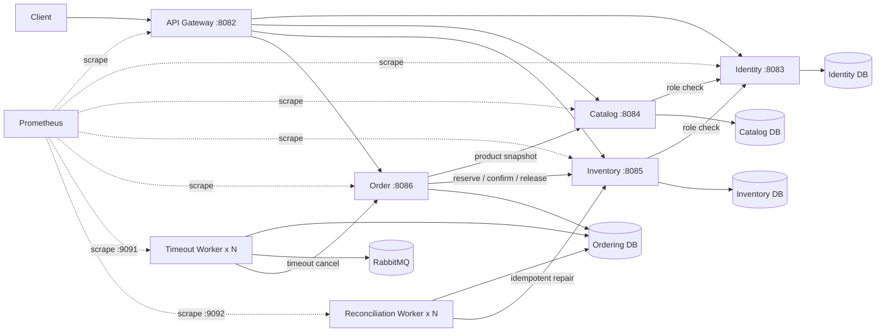

# Go Order Management Cloud-Native Lab

> 一个从 Go 分层单体持续演进而来的云原生实验项目，重点展示微服务数据边界、Inventory Reservation、Order Saga、Transactional Outbox、RabbitMQ Publisher Confirms、请求预算、有限重试、熔断、限流、自动对账、多 Worker 租约、Kubernetes 交付，以及 Prometheus 指标基础。

本仓库不是完整电商平台，也不宣称已经达到生产级云原生标准。当前已经完成：

- 微服务核心改造与四库数据所有权；
- 应用可靠性收口；
- Compose 完整业务验证；
- Kubernetes Kustomize base、local 和 test overlays；
- kind 实际部署、失败版本检测、`rollout undo` 和完整 Kubernetes Saga；
- Gateway Ingress 合同与多副本工作负载 PodDisruptionBudget；
- 五个 HTTP 服务和两个 Worker 的 Prometheus scrape 端点；
- HTTP、Outbox、Saga、Reconciliation、Worker 和 RabbitMQ Publisher Confirm 指标；
- Prometheus Compose 拓扑、七个 target 健康检查和业务指标自动验收。

Grafana、正式告警、OpenTelemetry、跨服务 Trace、HPA、NetworkPolicy、GHCR 和正式环境持续交付仍在后续阶段。

## 当前能力矩阵

| 维度 | 当前实现 |
| --- | --- |
| 运行单元 | API Gateway + Identity + Catalog + Inventory + Order + Timeout Worker + Reconciliation Worker |
| 数据边界 | `go_order_identity`、`go_order_catalog`、`go_order_inventory`、`go_order_ordering` |
| 一致性 | Inventory Reservation + Order Saga + 补偿 + 自动对账 |
| 异步可靠性 | Transactional Outbox + RabbitMQ TTL/DLX + Publisher Confirms + 至少一次投递 |
| HTTP 可靠性 | Request ID + deadline + Transport 超时 + 有限重试 + 操作级熔断 |
| 入口保护 | Gateway 客户端/全局 Token Bucket + HTTP 429 |
| Worker 扩容 | Timeout/Reconciliation Worker 均使用租约与 `FOR UPDATE SKIP LOCKED` |
| 数据库迁移 | 四套独立 Goose migration；Compose 和 Kubernetes 均使用一次性迁移任务 |
| Compose 验证 | 四库、RabbitMQ、2 个 Timeout Worker、2 个 Reconciliation Worker、完整 Saga |
| Kubernetes 清单 | base + local/test overlays、StatefulSet、Deployment、Service、Migration Job、ConfigMap/Secret、Ingress、PDB |
| Kubernetes 运行验证 | CI 创建真实 kind 集群，验证部署、暴露面、双 Worker、失败 rollout、`rollout undo` 和完整 Saga |
| Prometheus 应用指标 | 七个 scrape endpoint；HTTP server/client、Order、Outbox、Reconciliation、Worker、RabbitMQ publish metrics |
| Prometheus 自动验收 | Compose 启动 Prometheus，运行完整 Saga，验证七个 targets `up` 和关键时序可查询 |

## 运行拓扑



只有 API Gateway 对外提供业务入口；业务服务、数据库、RabbitMQ 和 Worker 保持内部通信。Prometheus 是可选观测组件，不参与业务就绪链路。

## 核心可靠性设计

### Order Saga

```text
Catalog snapshot
    ↓
create reserving Order
    ↓
Inventory reserve using stable reservation_id
    ↓
Order pending + timeout Outbox
```

- 库存预占失败：订单转为 `failed`；
- 本地落单失败：释放库存预占；
- 补偿结果不确定：进入 `reconciliation_required`；
- 支付：确认预占；
- 主动取消或超时：释放预占。

### Outbox 与 Timeout Worker

- `FOR UPDATE SKIP LOCKED` 领取事件；
- `lease_owner` / `lease_until` 支持多副本和崩溃恢复；
- Broker ACK 后才将 Outbox 标记为 `published`；
- NACK、确认超时和连接异常进入可重试失败；
- 保持 at-least-once，消费者依靠幂等状态机处理重复消息。

### 自动对账

Ordering 数据库维护结构化 `order_reconciliation_tasks`。Reconciliation Worker：

- 多副本租约领取；
- 复用 HTTP deadline、有限重试和熔断；
- 执行幂等 confirm/release；
- 未知动作保持 `unresolved`；
- 支持真正只读的 dry-run 预演。

```bash
docker compose run --rm \
  -e RECONCILIATION_DRY_RUN=true \
  order-reconciliation-worker
```

## Docker Compose 运行

基础业务拓扑：

```bash
cp .env.example .env

docker compose config --quiet
docker compose up -d --build --wait \
  --scale order-timeout-worker=2 \
  --scale order-reconciliation-worker=2

curl --fail http://127.0.0.1:8082/readyz
sh scripts/smoke/microservices-saga.sh
```

清理：

```bash
docker compose down -v --remove-orphans
```

## Prometheus 运行

Prometheus 通过独立 Compose overlay 加入，不改变默认业务拓扑：

```bash
docker compose -f compose.yml -f compose.observability.yml up -d --build --wait \
  --scale order-timeout-worker=2 \
  --scale order-reconciliation-worker=2
```

入口：

```text
Prometheus UI/API: http://127.0.0.1:9090
```

抓取端点：

| 目标 | 端点 |
| --- | --- |
| API Gateway | `:8082/metrics` |
| Identity | `:8083/metrics` |
| Catalog | `:8084/metrics` |
| Inventory | `:8085/metrics` |
| Order | `:8086/metrics` |
| Timeout Worker | `:9091/metrics` |
| Reconciliation Worker | `:9092/metrics` |

自动验证：

```bash
sh scripts/smoke/microservices-saga.sh
python3 scripts/smoke/prometheus-metrics.py
```

关键指标包括：

```text
go_order_http_server_requests_total
go_order_http_server_request_duration_seconds
go_order_http_client_attempts_total
go_order_orders{status}
go_order_outbox_events{status}
go_order_reconciliation_required
go_order_worker_up{worker}
go_order_rabbitmq_publish_total{outcome}
```

指标禁止使用 request ID、user ID、order ID、reservation ID、原始 URL、查询字符串或错误消息作为标签。

## Kubernetes 运行与验证

```text
deploy/kubernetes/
├── base/
└── overlays/
    ├── local/
    └── test/
```

Local overlay 用于 kind 自动验收：

```bash
kustomize build deploy/kubernetes/overlays/local >/tmp/go-order-local.yaml
sh scripts/k8s/deploy-local.sh
sh scripts/smoke/microservices-saga-kubernetes.sh
```

Test overlay 用于非生产交付合同：

- 七个应用运行单元均为 2 副本；
- 七个 `minAvailable: 1` PDB；
- 一个 `nginx` Gateway Ingress；
- 默认主机名 `go-order.test.local`；
- MySQL、RabbitMQ 和业务 Service 保持 ClusterIP；
- Secret 仅为占位值。

```bash
kustomize build deploy/kubernetes/overlays/test >/tmp/go-order-test.yaml
```

Kubernetes base 为七个应用 Pod 提供 Prometheus scrape annotations；两个 Worker 同时声明 metrics container port。当前未在 Kubernetes 内安装 Prometheus Server 或 Prometheus Operator。

## CI 质量门禁

### Go 与 Compose

```text
golangci-lint
go test ./...
go test -race ./...
go vet ./...
go build ./...
旧单体与四套服务 migration validate
7 个服务/Worker 二进制构建
Docker Compose 配置与镜像
四库与 RabbitMQ
2 个 Timeout Worker
2 个 Reconciliation Worker
完整 Compose Order Saga
```

### kind Runtime

```text
创建 disposable kind 集群
构建并加载 7 个应用镜像
等待 StatefulSet、Migration Job 和 Deployment
验证 Service 暴露边界与双类 Worker
失败 rollout 检测
kubectl rollout undo
完整 Kubernetes Order Saga
失败诊断与集群清理
```

### Kubernetes Contracts

```text
渲染 local/test overlays
验证 Ingress、PDB、副本数和 Service 暴露边界
上传渲染 YAML artifact
```

### Prometheus Metrics

```text
启动完整应用和 Prometheus
运行完整 Order Saga
验证 7 个 application targets 全部 up
验证 HTTP、Order、Outbox 和 Worker 关键指标可查询
失败时上传 target、query 和 Compose diagnostics
```

## 文档入口

- [文档导航](docs/README.md)
- [微服务数据所有权与 Order Saga](docs/architecture/microservices-v2-data-ownership.md)
- [Outbox 租约与 Publisher Confirms](docs/architecture/migrations-outbox-leasing.md)
- [HTTP 请求预算与有限重试](docs/architecture/http-timeout-retry.md)
- [熔断与 Gateway 限流](docs/architecture/circuit-breaker-rate-limit.md)
- [自动 Order 对账 Worker](docs/architecture/reconciliation-worker.md)
- [Kubernetes 基础与运行验收](docs/architecture/kubernetes-foundation.md)
- [Prometheus 指标基础](docs/architecture/prometheus-metrics.md)
- [云原生完成度与缺口](docs/architecture/cloud-native-status.md)
- [项目演进记录](docs/project_evolution.md)

## 当前边界

已经完成：

- 微服务、独立数据所有权、Reservation、Saga、Outbox 和 Publisher Confirms；
- 请求预算、有限重试、熔断、限流和自动对账；
- Compose 四库、四个 Worker 副本和完整 Saga；
- Kubernetes base/local/test、kind 部署、回滚、Saga、Ingress/PDB 合同；
- Prometheus 应用指标、Compose 抓取拓扑、七 target 自动验收和 Kubernetes scrape 合同。

尚未完成：

- Grafana Dashboard 与正式 Prometheus 告警规则；
- OpenTelemetry、W3C Trace Context、`trace_id` / `span_id` 日志字段；
- RabbitMQ consumer 细粒度计数和基础设施 Exporter；
- HPA、NetworkPolicy、多节点故障和真实 Ingress 流量验收；
- GHCR、测试环境持续部署和不可变版本推广；
- 最小权限账号、mTLS/Workload Identity；
- 备份恢复、Runbook、压测和故障演练。

> **当前已完成应用可靠性、Kubernetes 基础和 Prometheus 指标基础；仍未达到生产级云原生交付状态。**
