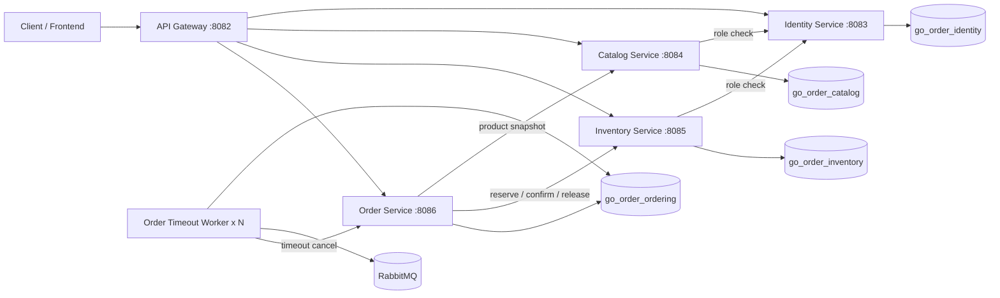
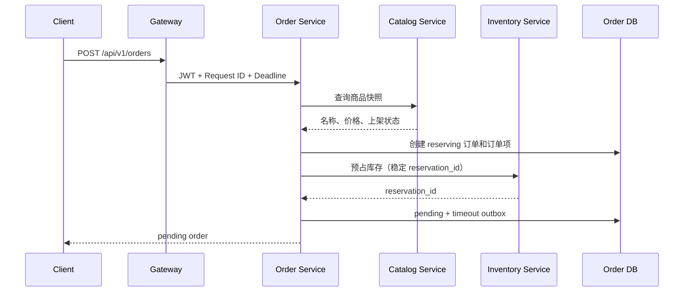

# Go Order Management Cloud-Native Lab

> 一个从 Go 分层单体持续演进而来的微服务实验项目，重点展示服务拆分、数据库所有权、库存预占、订单 Saga、Transactional Outbox、RabbitMQ Publisher Confirms、多 Worker 租约抢占、端到端请求预算、有限重试、操作级熔断、Gateway Token Bucket 限流、独立数据库迁移和端到端 CI 验证。

本仓库是实验性演进项目，不是完整电商平台，也不宣称已经达到生产级云原生交付标准。当前已经完成容器化微服务核心改造和应用可靠性基础收口；Kubernetes、完整可观测性、自动对账和持续部署仍属于后续阶段。

## 当前状态

| 维度 | 当前实现 |
| --- | --- |
| 运行形态 | API Gateway + 4 个业务服务 + 独立订单超时 Worker |
| 数据边界 | Identity、Catalog、Inventory、Ordering 使用 4 个独立逻辑数据库 |
| 一致性 | 库存预占/确认/释放 + Order Saga + 补偿事务 |
| 异步可靠性 | Transactional Outbox + RabbitMQ TTL/DLX + Publisher Confirms + 至少一次投递 |
| HTTP 可靠性 | Request ID + 端到端 deadline + 细分 Transport 超时 + 操作级有限重试 |
| 故障隔离 | 按上游和操作划分的 Closed/Open/Half-open 熔断器 |
| 入口保护 | Gateway 客户端 Token Bucket + 全局 Token Bucket + HTTP 429 |
| Worker 扩容 | 数据库租约 + `FOR UPDATE SKIP LOCKED`，支持多副本抢占 |
| 数据库迁移 | 每个服务拥有独立 Goose 迁移目录和一次性迁移 Job |
| 部署验证 | Docker Compose 启动完整四库拓扑，可启动两个 Worker 副本 |
| CI | lint、test、race、vet、build、迁移校验、镜像构建、完整 Saga 冒烟 |
| 尚未完成 | Kubernetes、Prometheus/Grafana、OpenTelemetry、自动对账、正式 CD |

## 运行拓扑



只有 API Gateway 默认暴露宿主机端口 `8082`；业务服务仅在 Compose 网络内部通信。

## 服务与数据所有权

| 服务 | 端口 | 数据库 | 主要职责 |
| --- | ---: | --- | --- |
| API Gateway | 8082 | 无 | 统一入口、反向代理、请求预算、Request ID、Token Bucket 限流、上游就绪检查 |
| Identity Service | 8083 | `go_order_identity` | 注册、登录、JWT、用户资料、角色校验 |
| Catalog Service | 8084 | `go_order_catalog` | 商品创建、查询、上下架、商品快照 |
| Inventory Service | 8085 | `go_order_inventory` | 库存管理、库存预占、确认、释放、库存流水 |
| Order Service | 8086 | `go_order_ordering` | 创建订单、状态机、Saga 编排、超时 Outbox |
| Order Timeout Worker | 无 HTTP 端口 | `go_order_ordering` | Outbox 抢占、确认发布、RabbitMQ 超时消费、调用订单取消 |

当前主要业务表：

```text
Identity
├── users
├── roles
└── user_roles

Catalog
└── catalog_products

Inventory
├── inventory_items
├── inventory_reservations
├── inventory_reservation_items
└── inventory_stock_logs

Ordering
├── orders_v2
├── order_items_v2
└── order_timeout_outbox_v2
```

## 下单 Saga



关键补偿规则：

- 库存预占失败：订单转为 `failed`；
- 库存已预占，但订单本地事务失败：调用 Inventory 释放预占；
- 释放补偿也失败：订单转为 `reconciliation_required`；
- 支付成功：Inventory 将预占从 `pending` 转为 `confirmed`；
- 主动取消或超时取消：Inventory 将预占转为 `released` 并回补可用库存。

## HTTP 请求预算、有限重试与熔断

Gateway 和四个业务服务统一处理：

```text
X-Request-ID
X-Request-Deadline
```

默认请求预算为 10 秒，外部传入 deadline 最长被限制为 30 秒。每个服务取“上游剩余 deadline”和“本地超时”中的较早者；已过期请求在进入业务 Handler 前返回 HTTP 504。

内部客户端显式配置连接、TLS 握手、响应头和单次调用总超时。以下结果可以在剩余预算内有限重试：

```text
网络/传输错误（调用方 Context 尚未失效）
HTTP 502
HTTP 503
HTTP 504
```

HTTP 4xx、业务冲突、调用方取消和调用方 deadline 耗尽不会自动重试。Gateway 不会重放外部业务请求。

库存预占重试始终复用相同的 `reservation_id` 和 JSON 请求体；确认、释放与超时取消接口依靠幂等语义安全重试。

每个客户端 Executor 按以下键维护独立熔断器：

```text
<upstream>/<operation>
```

默认连续 5 次选定基础设施失败后进入 Open，5 秒后允许 1 个 Half-open 探测。Open 状态在请求构造和网络 I/O 前快速失败。4xx 不计入熔断失败。

## Gateway Token Bucket 限流

业务流量进入反向代理前必须同时通过：

- 按直接 TCP 来源 IP 划分的客户端 Token Bucket；
- 保护整个 Gateway 进程的全局 Token Bucket。

默认值：

| 参数 | 默认值 |
| --- | ---: |
| 每客户端速率 | 50 req/s |
| 每客户端突发 | 100 |
| 全局速率 | 500 req/s |
| 全局突发 | 1000 |
| 最大客户端 Bucket | 10,000 |
| 非活跃 Bucket TTL | 10 分钟 |

超限返回 HTTP 429、`Retry-After` 和 `X-Request-ID`。`/live` 与 `/readyz` 绕过限流，避免健康检查被业务流量阻断。

当前限流状态位于单个 Gateway 进程内，不代表多副本集群级限流。项目尚未信任 `X-Forwarded-For`，因为还没有配置可信代理边界。

## Outbox、Publisher Confirms 与多 Worker

订单创建在 Ordering 数据库内写入 `order_timeout_outbox_v2`。Worker 通过租约字段安全领取事件：

```text
lease_owner
lease_until
next_attempt_at
```

领取查询使用 `FOR UPDATE SKIP LOCKED`，允许多个 Worker 跳过其他实例已经锁定的记录。Worker 崩溃后，租约过期的事件可以被其他实例重新领取。

Worker 使用独立发布通道进入 RabbitMQ Confirm Mode。只有收到 Broker ACK 后才把 Outbox 标记为 `published`；NACK、确认超时、发布通道关闭和直接发布错误都会将事件保留为可重试失败并重建会话。

当前语义仍是 **at-least-once**。RabbitMQ 已 ACK、但数据库尚未更新为 `published` 时进程崩溃，事件可能重复发布；超时取消接口依靠幂等状态机处理重复消息。

## 数据库迁移

运行时服务不再调用 GORM `AutoMigrate`。每个业务域拥有独立 Goose 目录：

```text
migrations/
├── identity/
├── catalog/
├── inventory/
└── ordering/
```

Compose 先执行 `db-init`，随后运行四个独立 Migration Job。迁移成功后，对应业务服务才会启动。根目录旧迁移仅用于原单体回归。

## 快速启动

### 依赖

- Docker；
- Docker Compose v2；
- 可选：Go 1.25.7、Goose v3.27.1，用于本地开发和迁移检查。

### 配置

```bash
cp .env.example .env
```

至少设置：

```env
MYSQL_PASSWORD=replace_with_a_database_password
JWT_SECRET=replace_with_a_32_plus_chars_random_secret
INTERNAL_SERVICE_TOKEN=replace_with_a_long_random_internal_service_token
```

主要可靠性配置：

```env
HTTP_CIRCUIT_FAILURE_THRESHOLD=5
HTTP_CIRCUIT_OPEN_INTERVAL=5s
HTTP_CIRCUIT_HALF_OPEN_MAX_PROBES=1

GATEWAY_RATE_LIMIT_PER_CLIENT_RPS=50
GATEWAY_RATE_LIMIT_PER_CLIENT_BURST=100
GATEWAY_RATE_LIMIT_GLOBAL_RPS=500
GATEWAY_RATE_LIMIT_GLOBAL_BURST=1000

RABBITMQ_PUBLISH_CONFIRM_TIMEOUT=5s
OUTBOX_LEASE_DURATION=30s
ORDER_TIMEOUT_DELAY=30m
```

### 启动完整拓扑

```bash
docker compose config --quiet
docker compose up -d --build --wait --scale order-timeout-worker=2
docker compose ps
```

健康检查：

```bash
curl --fail http://127.0.0.1:8082/ping
curl --fail http://127.0.0.1:8082/live
curl --fail http://127.0.0.1:8082/readyz
```

停止并清理：

```bash
docker compose down -v --remove-orphans
```

### 完整 Saga 冒烟测试

在 Linux、macOS、WSL 或 Git Bash 中：

```bash
export MYSQL_PASSWORD=replace_with_a_database_password
sh scripts/smoke/microservices-saga.sh
```

该脚本验证：

1. 用户注册、登录和管理员授权；
2. 创建并上架商品；
3. 初始化库存；
4. 幂等下单和库存预占；
5. 支付确认预占；
6. 主动取消释放库存；
7. RabbitMQ 超时取消和库存补偿。

## CI 验证

GitHub Actions 当前执行：

```text
golangci-lint
go test ./...
go test -race ./...
go vet ./...
go build ./...
旧单体迁移 validate
4 个服务迁移目录 validate
6 个服务二进制构建
Compose 配置校验
全部服务镜像构建
四数据库完整拓扑启动
两个 Timeout Worker 副本检查
Gateway readiness
完整订单 Saga 冒烟测试
```

CI 不是只做静态编译，而是会实际启动完整容器拓扑并执行跨服务业务链路。

## 项目结构

```text
cmd/
├── api-gateway/
├── identity-service/
├── catalog-service/
├── inventory-service/
├── order-service/
└── order-timeout-worker/

internal/
├── catalogsvc/
├── inventorysvc/
├── ordersvc/
└── platform/
    ├── internalapi/
    ├── ratelimit/
    ├── resiliencehttp/
    ├── serviceclient/
    └── servicehost/

migrations/
├── identity/
├── catalog/
├── inventory/
└── ordering/
```

仓库中仍保留原单体的 `handler/service/dao/model`、旧迁移和前端目录，用于历史回归和展示演进过程。当前微服务运行路径以 `cmd/*-service`、`internal/*svc` 和服务独立迁移目录为准。

## 文档入口

- [文档导航](docs/README.md)
- [微服务数据所有权与订单 Saga](docs/architecture/microservices-v2-data-ownership.md)
- [服务迁移、Outbox 租约与 Publisher Confirms](docs/architecture/migrations-outbox-leasing.md)
- [HTTP 请求预算与有限重试](docs/architecture/http-timeout-retry.md)
- [熔断与 Gateway 限流](docs/architecture/circuit-breaker-rate-limit.md)
- [云原生完成度与缺口](docs/architecture/cloud-native-status.md)
- [项目演进记录](docs/project_evolution.md)
- [CI 与运行验证](docs/verification/ci-baseline.md)

## 当前边界

已经完成：

- 独立进程、独立容器和 API Gateway；
- 服务独立数据库和数据所有权；
- 库存预占与订单 Saga；
- Transactional Outbox 与 RabbitMQ 超时补偿；
- RabbitMQ Publisher Confirms；
- 多 Worker 租约抢占；
- 端到端请求预算与操作级有限重试；
- 操作级基础熔断；
- Gateway 客户端与全局 Token Bucket 限流；
- 服务独立 Goose 迁移；
- 完整 Compose 与端到端 CI 验证。

尚未完成：

- Kubernetes Deployment、Service、Ingress、ConfigMap、Secret、Job 和 HPA；
- Prometheus、Grafana、OpenTelemetry 和集中式日志；
- Outbox/Saga 指标、自动对账、并发隔离和自适应超时；
- 最小权限数据库账户、mTLS/Workload Identity；
- 镜像 Registry、环境部署、滚动发布和自动回滚；
- 备份恢复、告警、压测与故障演练。

因此，当前最准确的项目描述是：

> **完成微服务核心改造、容器化验证和应用可靠性基础收口的云原生演进实验项目，尚未达到生产级云原生交付状态。**
