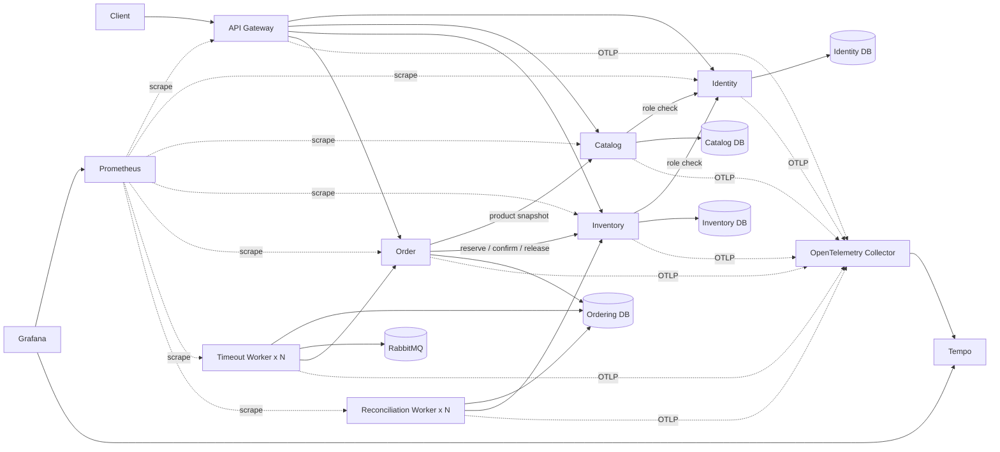

# Go Order Management Cloud-Native Lab

> 一个从 Go 分层单体演进而来的云原生工程实验项目，重点展示微服务数据边界、订单与库存一致性、消息可靠性、应用韧性、Kubernetes 交付、可观测性和可重复运行保障。

## 项目定位

当前系统包含七个运行单元：

```text
API Gateway
Identity Service
Catalog Service
Inventory Service
Order Service
Order Timeout Worker
Order Reconciliation Worker
```

数据由四个服务数据库分别拥有：

```text
go_order_identity
go_order_catalog
go_order_inventory
go_order_ordering
```

项目已经完成既定的 Phase 5–8 工程路线，但仍是**可执行验证的云原生实验系统**，不宣称是生产级平台。

## 已完成能力

| 能力域 | 当前实现 |
| --- | --- |
| 业务一致性 | Inventory Reservation、Order Saga、补偿、自动对账 |
| 消息可靠性 | Transactional Outbox、RabbitMQ TTL/DLX、Publisher Confirms、手动 ACK、at-least-once |
| Worker 并发 | 两类 Worker 多副本、租约、`FOR UPDATE SKIP LOCKED`、崩溃后回收 |
| HTTP 韧性 | Request ID、绝对 Deadline、细分超时、有限重试、指数退避、操作级熔断 |
| 入口保护 | Gateway 客户端与全局 Token Bucket、HTTP 429、`Retry-After` |
| 数据库迁移 | 四套 Goose migration；Compose/Kubernetes 一次性 Migration Job |
| Compose 验收 | 四库、RabbitMQ、双类 Worker 各 2 副本、完整订单 Saga |
| Kubernetes | Kustomize base/local/test、StatefulSet、Deployment、Service、Probe、resources、Ingress、PDB |
| Kubernetes 运行验收 | disposable kind、失败 revision、`rollout undo`、恢复后完整 Saga |
| 可观测性 | Prometheus、Grafana、recording/alert rules、OpenTelemetry、Collector、Tempo |
| 镜像发布 | 七个 GHCR 不可变镜像、完整 Commit SHA 标签、OCI Digest、发布清单 |
| 自动 CD | 精确 Digest 部署到一次性 kind；Smoke Test；坏版本检测；完整 Digest 回滚 |
| 备份恢复 | 四库逻辑备份、SHA-256 清单、独立 MySQL 8.4 恢复、源库不可变证明 |
| 故障演练 | RabbitMQ、HTTP 熔断、Worker 租约、Migration 失败四类可重复演练 |
| 运行手册 | Operator Runbook、诊断/缓解/恢复步骤、事故复盘模板 |
| 有界压测 | 并发 1/4/8/16/32、P50/P95/P99、资源证据、容量边界分析 |

## Phase 8 最终验收

| 阶段 | 结果 | 主要证据 |
| --- | --- | --- |
| 8.1 不可变镜像 | 完成 | 七个 GHCR Digest 镜像与发布清单，Issue #43 |
| 8.2 自动测试环境 CD | 完成 | 精确 Digest 部署、双 Smoke、坏版本与回滚，Issue #48 |
| 8.3 备份恢复 | 完成 | 四库备份、隔离恢复、损坏输入拒绝，Issue #50 |
| 8.4 故障演练 | 完成 | 主分支运行 `29323288284`，Issue #51 |
| 8.5 Runbook 与压测 | 完成 | 主分支运行 `29321080192`，Issue #52 |

压测的已接受结果：

```text
健康持续阶段最佳成功吞吐：177.989 requests/second
健康持续阶段最高 P95：31.812 ms
健康阶段错误数：0
首个观测边界：concurrency 8 的吞吐平台与尾延迟增长
```

这是单个 GitHub-hosted Runner 上的合成有界测试，不是生产容量承诺或 SLO。

## 运行拓扑



只有 API Gateway 提供业务入口。Prometheus、Grafana、Collector 和 Tempo 不参与业务 readiness。

## 本地 Compose 验证

```bash
cp .env.example .env

docker compose config --quiet
docker compose up -d --build --wait \
  --scale order-timeout-worker=2 \
  --scale order-reconciliation-worker=2

curl --fail http://127.0.0.1:8082/readyz
sh scripts/smoke/microservices-saga.sh
```

清理：

```bash
docker compose down -v --remove-orphans
```

## 可观测性环境

```bash
docker compose -f compose.yml -f compose.observability.yml up -d --build --wait \
  --scale order-timeout-worker=2 \
  --scale order-reconciliation-worker=2
```

默认入口：

```text
Prometheus  http://127.0.0.1:9090
Grafana     http://127.0.0.1:3000
Tempo       http://127.0.0.1:3200
OTLP/HTTP   http://127.0.0.1:14318
```

## 主要自动化工作流

```text
CI
Kubernetes Contracts
Observability Stack
Release Contracts
Publish Immutable Images
Deploy Verified Release to Test
Backup Contracts
Verify MySQL Backup and Restore
Fault Drill Contracts
Runtime Fault Drills
Operations Contracts
Bounded Load Test
```

PR 工作流保持只读和非破坏性；镜像发布可由受信任的 `main`、`release-*` 标签或手动入口触发；真实备份恢复、故障演练与有界压测只在受信任的 `main` 或手动入口执行。

## 项目边界

尚未实现、且不属于本轮既定收尾范围的生产增强包括：

- RabbitMQ 消息头中的 W3C Trace Context；
- Alertmanager 通知路由、正式 SLO 和错误预算；
- MySQL/RabbitMQ/Node 等基础设施 Exporter；
- 生产级多节点、跨可用区、托管数据库和长期 Trace/Backup 存储；
- mTLS、Workload Identity、运行时最小权限数据库账号；
- TLS、HPA、NetworkPolicy 和真实生产流量容量规划；
- MySQL PITR、增量备份和正式 RPO/RTO 承诺。

项目及其运行证据仅保存在 GitHub、GitHub Actions、GitHub Issues 和 GHCR，没有发布到 GitHub 之外的公开网站或长期运行环境。

## 文档入口

- [项目文档导航](docs/README.md)
- [云原生完成度与生产边界](docs/architecture/cloud-native-status.md)
- [项目演进记录](docs/project_evolution.md)
- [Phase 8 收口验收](docs/verification/phase-08-closure.md)
- [Operator Runbook](docs/runbooks/operations.md)
- [有界压测说明](docs/verification/load-test.md)
