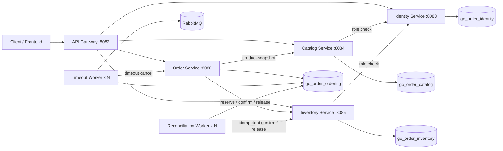
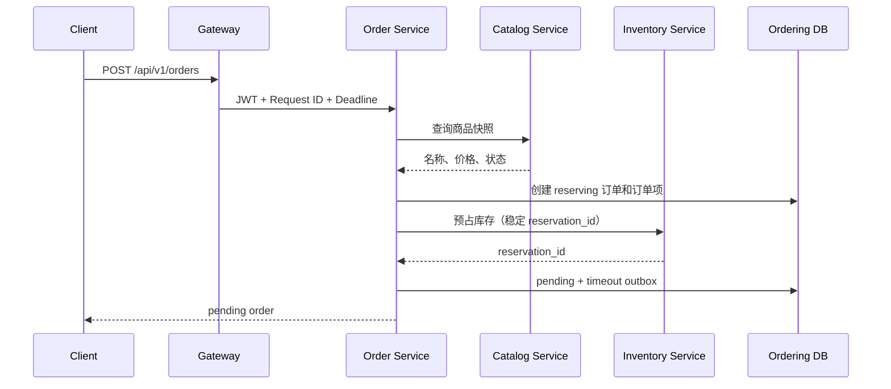

# Go Order Management Cloud-Native Lab

> 一个从 Go 分层单体持续演进而来的微服务实验项目，重点展示服务拆分、数据库所有权、Inventory Reservation、Order Saga、Transactional Outbox、RabbitMQ Publisher Confirms、请求预算、有限重试、熔断、限流、运行指标、自动对账、多 Worker 租约、独立迁移和端到端 CI。

本仓库不是完整电商平台，也不宣称已经达到生产级云原生交付标准。当前已经完成**微服务核心改造、容器化验证和应用可靠性收口**；下一阶段是 Kubernetes 基础，之后才是完整可观测性与持续交付。

## 当前状态

| 维度 | 当前实现 |
| --- | --- |
| 运行单元 | API Gateway + 4 个业务服务 + Timeout Worker + Reconciliation Worker |
| 数据边界 | Identity、Catalog、Inventory、Ordering 使用 4 个独立逻辑数据库 |
| 一致性 | Inventory Reservation + Order Saga + 补偿 + 结构化自动对账 |
| 异步可靠性 | Transactional Outbox + RabbitMQ TTL/DLX + Publisher Confirms + 至少一次投递 |
| HTTP 可靠性 | Request ID + deadline + 细分 Transport 超时 + 有限重试 + 操作级熔断 |
| 入口保护 | Gateway 客户端/全局 Token Bucket + HTTP 429 |
| 运行指标 | Outbox/Saga 两条聚合 SQL + 内部端点 + 周期结构化日志 |
| Worker 扩容 | Timeout 与 Reconciliation Worker 均使用租约和 `FOR UPDATE SKIP LOCKED` |
| 数据库迁移 | 每个服务独立 Goose migration 和一次性 Migration Job |
| 部署验证 | Docker Compose 启动 4 个数据库、2 个 Timeout Worker 和 2 个 Reconciliation Worker |
| CI | lint、test、race、vet、build、迁移、镜像、完整 Saga 冒烟 |
| 尚未完成 | Kubernetes、Prometheus/Grafana、OpenTelemetry、正式 CD、备份恢复和故障演练 |

## 运行拓扑



只有 API Gateway 默认暴露宿主机端口 `8082`；业务服务和 Worker 仅在 Compose 网络内部通信。

## 服务与数据所有权

| 运行单元 | 端口 | 数据库 | 主要职责 |
| --- | ---: | --- | --- |
| API Gateway | 8082 | 无 | 统一入口、请求预算、Request ID、限流、反向代理、上游就绪检查 |
| Identity Service | 8083 | `go_order_identity` | 注册、登录、JWT、用户资料、角色校验 |
| Catalog Service | 8084 | `go_order_catalog` | 商品创建、查询、上下架和商品快照 |
| Inventory Service | 8085 | `go_order_inventory` | 库存、预占、确认、释放和库存流水 |
| Order Service | 8086 | `go_order_ordering` | 订单状态机、Saga、Outbox 和可靠性指标端点 |
| Timeout Worker | 无 | `go_order_ordering` | Outbox 抢占、确认发布、RabbitMQ 超时消费 |
| Reconciliation Worker | 无 | `go_order_ordering` | 领取对账任务并修复已分类的不一致 |

Ordering 当前主要表：

```text
orders_v2
order_items_v2
order_timeout_outbox_v2
order_reconciliation_tasks
```

## 下单 Saga



关键规则：

- 预占失败：订单转为 `failed`；
- 预占成功但本地事务失败：释放库存预占；
- 释放也失败：订单转为 `reconciliation_required`；
- 支付：预占转为 `confirmed`；
- 主动取消或超时：预占转为 `released`。

## HTTP 请求预算、有限重试与熔断

Gateway 和业务服务传播：

```text
X-Request-ID
X-Request-Deadline
```

内部客户端显式配置 TCP、TLS、响应头和单次调用总超时，只在剩余预算允许时重试选定网络错误和 HTTP 502/503/504。HTTP 4xx、业务冲突、调用方取消和 deadline 耗尽不会自动重试。

库存预占重试复用相同的 `reservation_id` 和请求体；确认、释放与超时取消依靠幂等语义。Gateway 不重放外部业务请求。

每个内部客户端按以下键维护独立熔断器：

```text
<upstream>/<operation>
```

默认连续 5 次选定基础设施失败后进入 Open，5 秒后允许一个 Half-open 探测。4xx 不计入熔断失败。

## Gateway Token Bucket 限流

业务请求进入反向代理前必须同时通过：

- 按直接 TCP 来源 IP 划分的客户端 Bucket；
- 保护 Gateway 进程的全局 Bucket。

超限返回 HTTP 429、`Retry-After` 和 `X-Request-ID`。`/live` 与 `/readyz` 绕过限流。

当前限流状态只存在于单个 Gateway 进程中，不代表集群级分布式限流。

## Outbox 与 Publisher Confirms

Timeout Worker 使用：

```text
lease_owner
lease_until
next_attempt_at
FOR UPDATE SKIP LOCKED
```

发布通道开启 RabbitMQ Confirm Mode。只有 Broker ACK 后才将 Outbox 标记为 `published`；NACK、确认超时、通道关闭和直接发布错误都会进入可重试失败。

当前仍是 **at-least-once**。Broker 已 ACK、数据库尚未更新时进程崩溃，事件可能重复发布；超时取消接口依靠幂等状态机处理重复消息。

## Outbox 与 Order Saga 运行指标

Order Service 提供受内部 Token 保护的只读端点：

```http
GET /internal/v1/operations/reliability
```

每个快照只执行：

```text
1 条 Outbox 聚合 SQL
1 条 Order 聚合 SQL
```

指标覆盖：

- Outbox 各状态、有效租约、可重试、超时未完成、年龄和尝试次数；
- 所有 Order 状态、`reconciliation_required` 数量与年龄；
- 长时间处于 `reserving`、`paying`、`cancelling` 的订单。

端点不返回用户、订单、预占、消息正文或失败详情。Timeout Worker 还会周期输出同一快照的结构化日志。

这不是 Prometheus 时序接口，而是后续 Collector 可复用的数据源。

## 自动 Order Reconciliation Worker

Ordering migration 新增：

```text
order_reconciliation_tasks
trg_orders_v2_create_reconciliation_task
```

订单进入 `reconciliation_required` 时，触发器根据原状态创建结构化动作：

| 原状态 | 动作 |
| --- | --- |
| `reserving` | `release_inventory_and_fail` |
| `cancelling` | `finalize_cancel` |
| `paying` | `finalize_payment` |
| 其他 | `unresolved` |

触发器不解析 `failure_reason`，并与订单状态更新处于同一 MySQL 事务。回滚订单更新时，对账任务也会回滚。

Reconciliation Worker：

- 使用租约和 `FOR UPDATE SKIP LOCKED`；
- 支持多个副本和过期租约恢复；
- 复用 InventoryClient 的 deadline、重试与熔断；
- 通过原 reservation ID 重复执行幂等 release/confirm；
- 本地订单最终状态、Outbox 完成和任务完成同事务；
- 失败进入有界指数重试；
- 未知动作或状态不匹配保持 `unresolved`；
- 保留原始 `failure_reason` 历史。

默认配置：

```text
RECONCILIATION_POLL_INTERVAL=2s
RECONCILIATION_RETRY_DELAY=5s
RECONCILIATION_MAX_RETRY_DELAY=5m
RECONCILIATION_LEASE_DURATION=30s
RECONCILIATION_CALL_TIMEOUT=10s
RECONCILIATION_BATCH_SIZE=10
```

## 数据库迁移

运行时服务不调用 GORM `AutoMigrate`。服务拥有独立 Goose 目录：

```text
migrations/identity
migrations/catalog
migrations/inventory
migrations/ordering
```

Compose 创建四个数据库并运行四个 Migration Job；迁移成功后业务进程才启动。

## 快速启动

依赖：Docker 与 Docker Compose v2。

```bash
cp .env.example .env
docker compose config --quiet
docker compose up -d --build --wait \
  --scale order-timeout-worker=2 \
  --scale order-reconciliation-worker=2
docker compose ps
```

健康检查：

```bash
curl --fail http://127.0.0.1:8082/ping
curl --fail http://127.0.0.1:8082/live
curl --fail http://127.0.0.1:8082/readyz
```

完整 Saga 冒烟测试：

```bash
sh scripts/smoke/microservices-saga.sh
```

停止并清理：

```bash
docker compose down -v --remove-orphans
```

## CI 验证

GitHub Actions 当前执行：

```text
golangci-lint
go test ./...
go test -race ./...
go vet ./...
go build ./...
单体 migration validate
4 个服务 migration validate
7 个服务/Worker 二进制
Compose 配置校验
全部镜像构建
4 个数据库
2 个 Timeout Worker
2 个 Reconciliation Worker
Gateway readiness
完整 Order Saga smoke
```

Reconciliation 阶段额外验证：

- 三种状态到动作的 Trigger 映射；
- 状态与任务创建事务回滚；
- 多 Worker 独占租约和过期回收；
- release/fail、cancel、payment 三种修复；
- 远程失败保持可重试；
- 未知动作保持 `unresolved`。

## 项目结构

```text
cmd/
├── api-gateway/
├── identity-service/
├── catalog-service/
├── inventory-service/
├── order-service/
├── order-timeout-worker/
└── order-reconciliation-worker/

internal/
├── catalogsvc/
├── inventorysvc/
├── ordersvc/
└── platform/

migrations/
├── identity/
├── catalog/
├── inventory/
└── ordering/
```

## 文档入口

- [文档导航](docs/README.md)
- [微服务数据所有权与 Order Saga](docs/architecture/microservices-v2-data-ownership.md)
- [Outbox 租约与 Publisher Confirms](docs/architecture/migrations-outbox-leasing.md)
- [HTTP 请求预算与有限重试](docs/architecture/http-timeout-retry.md)
- [熔断与 Gateway 限流](docs/architecture/circuit-breaker-rate-limit.md)
- [Outbox/Saga 运行指标](docs/architecture/reliability-indicators.md)
- [自动 Order 对账 Worker](docs/architecture/reconciliation-worker.md)
- [云原生完成度与缺口](docs/architecture/cloud-native-status.md)
- [项目演进记录](docs/project_evolution.md)

## 当前边界

已经完成：

- 微服务进程、容器和数据所有权；
- Inventory Reservation 与 Order Saga；
- Transactional Outbox、Publisher Confirms 和 Timeout Worker 多副本；
- Request budget、有限重试、基础熔断和 Gateway 限流；
- Outbox/Saga 运行指标；
- 结构化自动对账与 Reconciliation Worker 多副本；
- 服务独立迁移；
- 四库、四个 Worker 副本和完整 Saga CI。

尚未完成：

- Kubernetes Deployment、Service、Ingress、ConfigMap、Secret、Job 和 HPA；
- Prometheus、Grafana、OpenTelemetry 和正式告警；
- 集群级限流、并发隔离和自适应超时；
- GHCR、测试环境部署、滚动更新和自动回滚；
- 最小权限账号、mTLS/Workload Identity；
- 备份恢复、Runbook、压测和故障演练。

> **当前是完成微服务核心改造、容器化验证和应用可靠性收口的云原生演进实验项目，尚未达到生产级云原生交付状态。**
