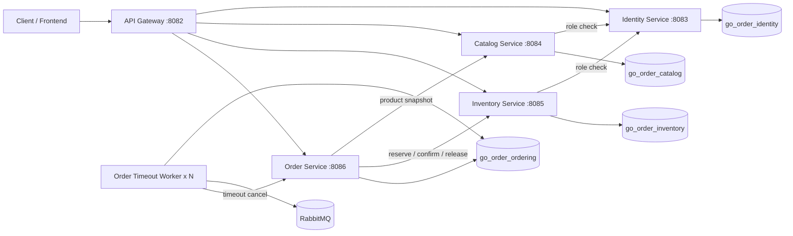
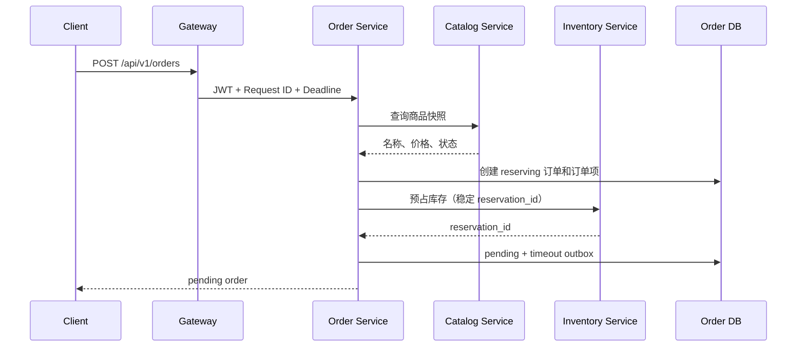

# Go Order Management Cloud-Native Lab

> 一个从 Go 分层单体持续演进而来的微服务实验项目，重点展示服务拆分、数据库所有权、库存预占、订单 Saga、Transactional Outbox、RabbitMQ Publisher Confirms、多 Worker 租约抢占、端到端请求预算、有限重试、操作级熔断、Gateway Token Bucket 限流、Outbox/Saga 运行指标、独立数据库迁移和端到端 CI 验证。

本仓库是实验性演进项目，不是完整电商平台，也不宣称已经达到生产级云原生交付标准。当前已经完成容器化微服务核心改造和应用可靠性基础收口；Kubernetes、Prometheus/Grafana、OpenTelemetry、自动对账和持续部署仍属于后续阶段。

## 当前状态

| 维度 | 当前实现 |
| --- | --- |
| 运行形态 | API Gateway + Identity、Catalog、Inventory、Order + 独立 Timeout Worker |
| 数据边界 | 4 个服务拥有 4 个独立逻辑数据库 |
| 一致性 | 库存预占/确认/释放 + Order Saga + 补偿事务 |
| 异步可靠性 | Transactional Outbox + RabbitMQ TTL/DLX + Publisher Confirms + 至少一次投递 |
| HTTP 可靠性 | Request ID + 端到端 deadline + 细分 Transport 超时 + 有限重试 |
| 故障隔离 | 按上游和操作划分的 Closed/Open/Half-open 熔断器 |
| 入口保护 | Gateway 客户端 Token Bucket + 全局 Token Bucket + HTTP 429 |
| 运行指标 | Outbox/Saga 两条聚合查询 + 内部 JSON 端点 + Worker 周期结构化日志 |
| Worker 扩容 | 数据库租约 + `FOR UPDATE SKIP LOCKED`，支持多副本抢占 |
| 数据库迁移 | 每个服务独立 Goose 迁移目录和一次性 Migration Job |
| 部署验证 | Docker Compose 启动完整四库拓扑和两个 Timeout Worker |
| CI | lint、test、race、vet、build、迁移、镜像、完整 Saga 冒烟 |
| 尚未完成 | Kubernetes、Prometheus/Grafana、OpenTelemetry、自动对账、正式 CD |

## 运行拓扑



只有 API Gateway 默认暴露宿主机端口 `8082`；业务服务仅在 Compose 网络内部通信。

## 服务与数据所有权

| 服务 | 端口 | 数据库 | 主要职责 |
| --- | ---: | --- | --- |
| API Gateway | 8082 | 无 | 统一入口、反向代理、请求预算、Request ID、限流、上游就绪检查 |
| Identity Service | 8083 | `go_order_identity` | 注册、登录、JWT、用户资料、角色校验 |
| Catalog Service | 8084 | `go_order_catalog` | 商品创建、查询、上下架、商品快照 |
| Inventory Service | 8085 | `go_order_inventory` | 库存管理、预占、确认、释放、库存流水 |
| Order Service | 8086 | `go_order_ordering` | 订单状态机、Saga 编排、Outbox、可靠性指标端点 |
| Order Timeout Worker | 无 HTTP 端口 | `go_order_ordering` | Outbox 抢占、确认发布、超时消费、周期指标日志 |

主要业务表：

```text
Identity
├── users
├── roles
└── user_roles

Catalog
└── catalog_products

Inventory
├── inventory_items
├── inventory_reservations
├── inventory_reservation_items
└── inventory_stock_logs

Ordering
├── orders_v2
├── order_items_v2
└── order_timeout_outbox_v2
```

## 下单 Saga



关键规则：

- 库存预占失败：订单转为 `failed`；
- 订单本地提交失败：调用 Inventory 释放预占；
- 释放补偿也失败：订单转为 `reconciliation_required`；
- 支付：预占转为 `confirmed`；
- 主动取消或超时取消：预占转为 `released` 并回补库存。

## HTTP 请求预算、有限重试与熔断

Gateway 和业务服务传播：

```text
X-Request-ID
X-Request-Deadline
```

内部客户端配置连接、TLS、响应头和单次调用总超时，只在剩余预算允许时重试选定网络错误和 HTTP 502/503/504。HTTP 4xx、业务冲突、调用方取消和 deadline 耗尽不会自动重试。Gateway 不重放外部业务请求。

库存预占重试复用相同的 `reservation_id` 和请求体；确认、释放和超时取消依靠幂等语义安全重试。

每个客户端 Executor 按以下键维护独立熔断器：

```text
<upstream>/<operation>
```

默认连续 5 次选定基础设施失败后进入 Open，5 秒后允许 1 个 Half-open 探测。Open 状态在请求构造和网络 I/O 前快速失败；4xx 不计入熔断失败。

## Gateway Token Bucket 限流

业务请求进入反向代理前必须同时通过：

- 按直接 TCP 来源 IP 划分的客户端 Token Bucket；
- 保护 Gateway 进程的全局 Token Bucket。

超限返回 HTTP 429、`Retry-After` 和 `X-Request-ID`。`/live` 与 `/readyz` 绕过限流。

当前限流状态只存在于单个 Gateway 进程中，不代表多副本集群级限流；在建立可信代理边界前，不信任 `X-Forwarded-For`。

## Outbox、Publisher Confirms 与多 Worker

Outbox Worker 使用：

```text
lease_owner
lease_until
next_attempt_at
```

领取查询采用 `FOR UPDATE SKIP LOCKED`。多个 Worker 可以同时运行，但同一时刻只有一个实例持有某条记录的有效租约。

发布通道开启 RabbitMQ Confirm Mode。只有 Broker ACK 后才将 Outbox 标记为 `published`；NACK、确认超时、通道关闭和直接发布错误都会保留为可重试失败。

当前仍是 **at-least-once**。Broker 已 ACK、数据库尚未更新时进程崩溃，事件可能重复发布；超时取消依靠幂等状态机处理重复消息。

## Outbox 与 Order Saga 运行指标

Order Service 提供受内部 Token 保护的只读端点：

```http
GET /internal/v1/operations/reliability
```

一次快照只执行：

```text
1 条 Outbox 聚合 SQL
1 条 Order 聚合 SQL
```

Outbox 指标包括：

- `pending`、`failed`、`published`、`completed` 数量；
- 有效租约、当前可重试、已超时未完成数量；
- 最老可处理事件年龄；
- 最大尝试次数和失败尝试总数。

Order Saga 指标包括：

- 每个订单状态数量；
- `reconciliation_required` 数量和最老年龄；
- 超过阈值仍处于 `reserving`、`paying`、`cancelling` 的订单数。

端点只返回聚合数据，不返回用户、订单、预占、消息正文或失败详情。每个 Timeout Worker 还会周期输出同一快照的结构化日志；查询失败只记录 Warning，不会终止 RabbitMQ 会话。

可选运行参数：

```text
ORDER_TRANSIENT_STUCK_THRESHOLD=5m
ORDER_RELIABILITY_LOG_INTERVAL=1m
```

这不是 Prometheus 指标接口；它是后续 Prometheus Collector 可复用的数据源。

## 数据库迁移

运行时服务不调用 GORM `AutoMigrate`。每个业务域拥有独立 Goose 目录：

```text
migrations/
├── identity/
├── catalog/
├── inventory/
└── ordering/
```

Compose 先创建四个数据库，再运行四个独立 Migration Job；迁移成功后业务服务才启动。

## 快速启动

依赖：Docker 和 Docker Compose v2。

```bash
cp .env.example .env
docker compose config --quiet
docker compose up -d --build --wait --scale order-timeout-worker=2
docker compose ps
```

健康检查：

```bash
curl --fail http://127.0.0.1:8082/ping
curl --fail http://127.0.0.1:8082/live
curl --fail http://127.0.0.1:8082/readyz
```

完整 Saga 冒烟测试：

```bash
sh scripts/smoke/microservices-saga.sh
```

停止并清理：

```bash
docker compose down -v --remove-orphans
```

## CI 验证

GitHub Actions 执行：

```text
golangci-lint
go test ./...
go test -race ./...
go vet ./...
go build ./...
旧单体迁移 validate
4 个服务迁移目录 validate
6 个服务二进制构建
Compose 配置校验
全部服务镜像构建
四数据库完整拓扑启动
两个 Timeout Worker 副本检查
Gateway readiness
完整订单 Saga 冒烟测试
```

指标阶段额外验证真实 MySQL 聚合结果、空数据库行为、固定时钟年龄、内部鉴权、错误信息不泄露，以及每个快照恰好两条 SQL。

## 项目结构

```text
cmd/
├── api-gateway/
├── identity-service/
├── catalog-service/
├── inventory-service/
├── order-service/
└── order-timeout-worker/

internal/
├── catalogsvc/
├── inventorysvc/
├── ordersvc/
└── platform/
    ├── internalapi/
    ├── ratelimit/
    ├── resiliencehttp/
    ├── serviceclient/
    └── servicehost/

migrations/
├── identity/
├── catalog/
├── inventory/
└── ordering/
```

## 文档入口

- [文档导航](docs/README.md)
- [微服务数据所有权与 Order Saga](docs/architecture/microservices-v2-data-ownership.md)
- [Outbox 租约与 Publisher Confirms](docs/architecture/migrations-outbox-leasing.md)
- [HTTP 请求预算与有限重试](docs/architecture/http-timeout-retry.md)
- [熔断与 Gateway 限流](docs/architecture/circuit-breaker-rate-limit.md)
- [Outbox/Saga 运行指标](docs/architecture/reliability-indicators.md)
- [云原生完成度与缺口](docs/architecture/cloud-native-status.md)
- [项目演进记录](docs/project_evolution.md)
- [CI 与运行验证](docs/verification/ci-baseline.md)

## 当前边界

已经完成：

- 独立进程、独立容器和 API Gateway；
- 服务独立数据库和数据所有权；
- 库存预占与 Order Saga；
- Transactional Outbox、RabbitMQ 超时补偿和 Publisher Confirms；
- 多 Worker 租约抢占；
- 请求预算、有限重试、基础熔断和 Gateway 限流；
- Outbox/Saga 只读运行指标和周期结构化日志；
- 服务独立 Goose 迁移；
- 完整 Compose 与端到端 CI 验证。

尚未完成：

- Kubernetes Deployment、Service、Ingress、ConfigMap、Secret、Job 和 HPA；
- Prometheus、Grafana、OpenTelemetry 和集中式日志；
- 自动对账、并发隔离和自适应超时；
- 最小权限数据库账户、mTLS/Workload Identity；
- 镜像 Registry、环境部署、滚动发布和自动回滚；
- 备份恢复、告警、压测与故障演练。

> **当前是完成微服务核心改造、容器化验证和应用可靠性基础收口的云原生演进实验项目，尚未达到生产级云原生交付状态。**
