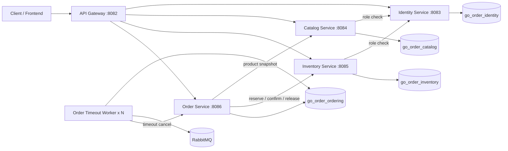
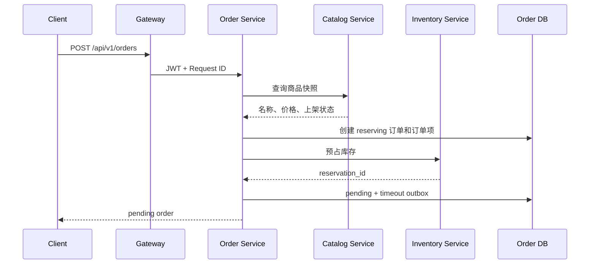

# Go Order Management Cloud-Native Lab

> 一个从 Go 分层单体持续演进而来的微服务实验项目，重点展示服务拆分、数据库所有权、库存预占、订单 Saga、Transactional Outbox、RabbitMQ 超时补偿、多 Worker 租约抢占、独立数据库迁移和端到端 CI 验证。

本仓库是实验性演进项目，不是完整电商平台，也不宣称已经达到生产级云原生交付标准。当前已经完成容器化微服务核心改造；Kubernetes、完整可观测性、服务弹性治理和持续部署仍属于后续阶段。

## 当前状态

| 维度 | 当前实现 |
| --- | --- |
| 运行形态 | API Gateway + 4 个业务服务 + 独立订单超时 Worker |
| 数据边界 | Identity、Catalog、Inventory、Ordering 使用 4 个独立逻辑数据库 |
| 一致性 | 库存预占/确认/释放 + Order Saga + 补偿事务 |
| 异步可靠性 | Transactional Outbox + RabbitMQ TTL/DLX + 至少一次投递 |
| Worker 扩容 | 数据库租约 + `FOR UPDATE SKIP LOCKED`，支持多副本抢占 |
| 数据库迁移 | 每个服务拥有独立 Goose 迁移目录和一次性迁移 Job |
| 部署验证 | Docker Compose 启动完整四库拓扑，可启动两个 Worker 副本 |
| CI | lint、test、race、vet、build、迁移校验、镜像构建、完整 Saga 冒烟 |
| 尚未完成 | Kubernetes、Prometheus/Grafana、OpenTelemetry、熔断限流、正式 CD |

## 运行拓扑



只有 API Gateway 默认暴露宿主机端口 `8082`；业务服务仅在 Compose 网络内部通信。

## 服务与数据所有权

| 服务 | 端口 | 数据库 | 主要职责 |
| --- | ---: | --- | --- |
| API Gateway | 8082 | 无 | 统一入口、反向代理、上游就绪检查、Request ID 透传 |
| Identity Service | 8083 | `go_order_identity` | 注册、登录、JWT、用户资料、角色校验 |
| Catalog Service | 8084 | `go_order_catalog` | 商品创建、查询、上下架、商品快照 |
| Inventory Service | 8085 | `go_order_inventory` | 库存管理、库存预占、确认、释放、库存流水 |
| Order Service | 8086 | `go_order_ordering` | 创建订单、状态机、Saga 编排、超时 Outbox |
| Order Timeout Worker | 无 HTTP 端口 | `go_order_ordering` | Outbox 抢占发布、RabbitMQ 超时消费、调用订单取消 |

当前主要业务表：

```text
Identity
├── users
├── roles
└── user_roles

Catalog
└── catalog_products

Inventory
├── inventory_items
├── inventory_reservations
├── inventory_reservation_items
└── inventory_stock_logs

Ordering
├── orders_v2
├── order_items_v2
└── order_timeout_outbox_v2
```

## 下单 Saga



关键补偿规则：

- 库存预占失败：订单转为 `failed`。
- 库存已预占，但订单本地事务失败：调用 Inventory 释放预占。
- 释放补偿也失败：订单转为 `reconciliation_required`，不伪装为普通失败。
- 支付成功：Inventory 将预占从 `pending` 转为 `confirmed`。
- 主动取消或超时取消：Inventory 将预占转为 `released` 并回补可用库存。

## Outbox 与多 Worker

订单创建在 Ordering 数据库内写入 `order_timeout_outbox_v2`。Worker 通过租约字段安全领取事件：

```text
lease_owner
lease_until
next_attempt_at
```

领取查询使用 `FOR UPDATE SKIP LOCKED`，允许多个 Worker 跳过其他实例已经锁定的记录。Worker 崩溃后，租约过期的事件可以被其他实例重新领取。

当前语义是 **at-least-once**。RabbitMQ 已接收消息、但数据库尚未更新为 `published` 时进程崩溃，事件可能重复发布；超时取消接口依靠幂等状态机处理重复消息。Publisher Confirms 尚未接入。

## 数据库迁移

运行时服务不再调用 GORM `AutoMigrate`。每个业务域拥有独立 Goose 目录：

```text
migrations/
├── identity/
├── catalog/
├── inventory/
└── ordering/
```

Compose 先执行：

```text
db-init
├── identity-migrate
├── catalog-migrate
├── inventory-migrate
└── ordering-migrate
```

迁移成功后，对应业务服务才会启动。根目录旧迁移保留用于原单体回归，不参与当前微服务 Compose 运行。

## 快速启动

### 依赖

- Docker
- Docker Compose v2
- 可选：Go 1.25.7、Goose v3.27.1，用于本地开发和迁移检查

### 配置

```bash
cp .env.example .env
```

至少设置：

```env
MYSQL_PASSWORD=replace_with_a_database_password
JWT_SECRET=replace_with_a_32_plus_chars_random_secret
INTERNAL_SERVICE_TOKEN=replace_with_a_long_random_internal_service_token
```

可选配置：

```env
ORDER_TIMEOUT_DELAY=30m
OUTBOX_LEASE_DURATION=30s
GATEWAY_HOST_PORT=8082
```

### 启动完整拓扑

```bash
docker compose config --quiet
docker compose up -d --build --wait --scale order-timeout-worker=2
docker compose ps
```

健康检查：

```bash
curl --fail http://127.0.0.1:8082/ping
curl --fail http://127.0.0.1:8082/live
curl --fail http://127.0.0.1:8082/readyz
```

停止并清理：

```bash
docker compose down -v --remove-orphans
```

### 完整 Saga 冒烟测试

在 Linux、macOS、WSL 或 Git Bash 中：

```bash
export MYSQL_PASSWORD=replace_with_a_database_password
sh scripts/smoke/microservices-saga.sh
```

该脚本验证：

1. 用户注册、登录和管理员授权；
2. 创建并上架商品；
3. 初始化库存；
4. 幂等下单和库存预占；
5. 支付确认预占；
6. 主动取消释放库存；
7. RabbitMQ 超时取消和库存补偿。

## CI 验证

GitHub Actions 当前执行：

```text
golangci-lint
go test ./...
go test -race ./...
go vet ./...
go build ./...
旧单体迁移 validate
4 个服务迁移目录 validate
6 个服务二进制构建
Compose 配置校验
全部服务镜像构建
四数据库完整拓扑启动
两个 Timeout Worker 副本检查
Gateway readiness
完整订单 Saga 冒烟测试
```

CI 不是只做静态编译，而是会实际启动完整容器拓扑并执行跨服务业务链路。

## 项目结构

```text
cmd/
├── api-gateway/
├── identity-service/
├── catalog-service/
├── inventory-service/
├── order-service/
└── order-timeout-worker/

internal/
├── catalogsvc/
├── inventorysvc/
├── ordersvc/
└── platform/
    ├── internalapi/
    ├── serviceclient/
    └── servicehost/

migrations/
├── identity/
├── catalog/
├── inventory/
└── ordering/

deploy/docker/             通用服务镜像构建
scripts/smoke/             端到端微服务业务验证
docs/architecture/        当前架构与历史基线
docs/verification/        CI 和运行验证说明
compose.yml                四库微服务本地编排
.github/workflows/ci.yml   完整持续集成流水线
```

仓库中仍保留原单体的 `handler/service/dao/model`、旧迁移和前端目录，用于历史回归和展示演进过程。当前微服务运行路径以 `cmd/*-service`、`internal/*svc` 和服务独立迁移目录为准。

## 文档入口

- [文档导航](docs/README.md)
- [微服务数据所有权与订单 Saga](docs/architecture/microservices-v2-data-ownership.md)
- [服务迁移与 Outbox 租约](docs/architecture/migrations-outbox-leasing.md)
- [云原生完成度与缺口](docs/architecture/cloud-native-status.md)
- [项目演进记录](docs/project_evolution.md)
- [CI 与运行验证](docs/verification/ci-baseline.md)

## 当前边界

已经完成：

- 独立进程、独立容器和 API Gateway；
- 服务独立数据库和数据所有权；
- 库存预占与订单 Saga；
- Transactional Outbox 与 RabbitMQ 超时补偿；
- 多 Worker 租约抢占；
- 服务独立 Goose 迁移；
- 完整 Compose 与端到端 CI 验证。

尚未完成：

- Kubernetes Deployment、Service、Ingress、ConfigMap、Secret、Job 和 HPA；
- Prometheus、Grafana、OpenTelemetry 和集中式日志；
- Publisher Confirms、标准重试、熔断、限流和隔离；
- 最小权限数据库账户、mTLS/Workload Identity；
- 镜像 Registry、环境部署、滚动发布和自动回滚；
- 备份恢复、对账任务、告警、压测与故障演练。

因此，当前最准确的项目描述是：

> **完成微服务核心改造和容器化验证的云原生演进实验项目，尚未达到生产级云原生交付状态。**
