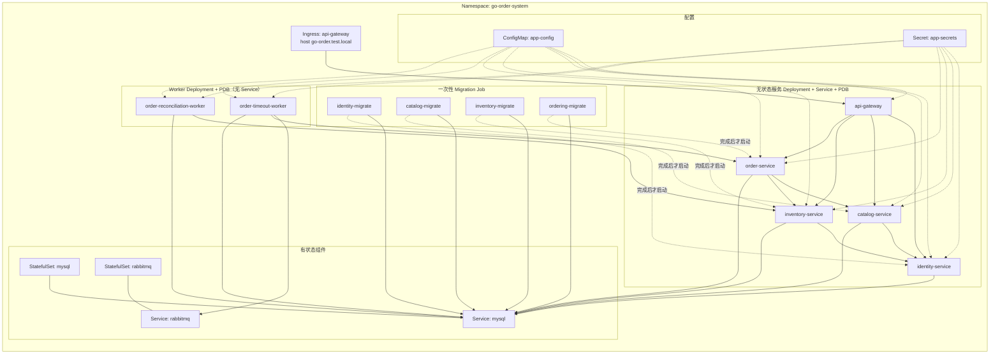

# 架构图

本文汇总项目的架构图：Kubernetes 资源关系用 Mermaid 手绘，服务内部调用关系由
`go-callvis` 从代码生成。**运行时服务拓扑**（网关、四个服务、两个 Worker、
Prometheus/Grafana/Tempo 的连接关系）已在根目录 [README.md](../README.md) 中，
本文不重复。

所有生成的图片位于 [diagrams/](diagrams/)，用 `make diagrams` 重新生成。

---

## Kubernetes 资源关系

以下是 `deploy/kubernetes/overlays/test` 实际渲染出的资源及其依赖关系。这类关系
go-callvis 无法表达，因此手绘。



几个值得注意的点：

- **四个 Migration Job 是启动前置条件**，不是并行的旁路。每个业务服务的 Deployment
  等待对应的 Job 成功完成后才启动，这保证了 schema 先于代码就位。
- **两个 Worker 没有 Service**。它们不接收入站流量，只主动出站 —— 超时 Worker 消费
  RabbitMQ 并回调 order-service，对账 Worker 轮询 Ordering 库并调用 inventory-service。
  因此它们不在 Ingress 路径上，也不被 Prometheus 通过 Service 发现。
- **只有 api-gateway 有 Ingress**。其余服务仅通过集群内 Service 名互访，不对外暴露。
- **七个工作负载都配了 PodDisruptionBudget**，包括两个 Worker。
- MySQL 和 RabbitMQ 是 StatefulSet，`overlays/local` 用于一次性 kind 集群，
  `overlays/test` 额外加了 Ingress 与 PDB。

---

## 服务内部调用关系（生成）

每个服务入口一张，由 `go-callvis` 做静态分析生成，按包分组，范围限定在本模块内。

| 服务 | 图 |
| --- | --- |
| API Gateway | [api-gateway.svg](diagrams/api-gateway.svg) |
| Identity Service | [identity-service.svg](diagrams/identity-service.svg) |
| Catalog Service | [catalog-service.svg](diagrams/catalog-service.svg) |
| Inventory Service | [inventory-service.svg](diagrams/inventory-service.svg) |
| Order Service | [order-service.svg](diagrams/order-service.svg) |
| Timeout Worker | [order-timeout-worker.svg](diagrams/order-timeout-worker.svg) |
| Reconciliation Worker | [order-reconciliation-worker.svg](diagrams/order-reconciliation-worker.svg) |

这几张图最能说明问题的地方，是**四个业务服务的入口层高度同构**。它们共用同一组基础
设施包 —— `platform/servicehost` 建 HTTP server、`middleware` 挂中间件、`auth` 校验
JWT、`platform/resiliencehttp` 提供带超时重试熔断的出站 transport（网关也用它），差异
只在各自的 `internal/xxxsvc` 业务包。

真正区分它们的是服务间调用中扮演的角色：identity-service 引入
`platform/internalapi`，因为它是被调用方，需要校验内部 token；catalog-service 和
inventory-service 引入 `platform/serviceclient`，因为它们要回调 identity 做角色校验；
order-service 两者都不在 main 里出现，它的出站客户端封装在 `internal/ordersvc/clients.go`
中，这也是唯一一处需要契约化的调用面（见
[architecture/grpc-inventory-contract.md](architecture/grpc-inventory-contract.md)）。

## 包依赖关系（生成）

[package-dependencies.svg](diagrams/package-dependencies.svg) —— 由 `goda` 生成，
覆盖本模块全部 37 个包。用途与上面的调用图互补：调用图回答「这个服务运行时会走到哪些
包」，依赖图回答「包与包之间谁可以 import 谁」，后者更适合用来发现分层被打破的情况。

---

## 重新生成

```bash
make diagrams
```

需要 `go-callvis` 和 graphviz：

```bash
go install github.com/ondrajz/go-callvis@latest
# Windows: scoop install graphviz / macOS: brew install graphviz / Debian: apt-get install graphviz
```

`goda` 通过 `go run` 固定版本调用，无需预先安装。生成过程会产生 `.gv` 中间文件，
target 结束时自动删除，仓库只跟踪 SVG。

**关于 `-nostd`**：AGENT.md 给出的示例命令带 `-nostd`，但在本项目上它会产出空图 ——
该标志与 go-callvis 默认的 `-focus main` 叠加后会剪掉所有边。实际使用的是
`-limit <模块名>`，效果相同（只保留本项目的包）且图不为空。

## 这些图没有表达什么

- **跨服务的运行时调用**。go-callvis 做的是单个二进制内的静态分析，服务之间的 HTTP
  调用在图上表现为终止于 `internal/ordersvc` 的客户端函数，不会延伸到对端服务。跨服务
  关系见 README 的拓扑图和
  [architecture/microservices-v2-data-ownership.md](architecture/microservices-v2-data-ownership.md)。
- **通过接口的动态分发**。静态分析对 interface 方法调用的解析是保守的，DAO 层经接口
  调用的边可能缺失。
- **数据流与事务边界**。图上只有调用关系，没有谁写哪张表、事务在哪里开始结束。这部分见
  [architecture/transaction-boundaries.md](architecture/transaction-boundaries.md)。
- **图不会自动更新**。`make diagrams` 是手动执行的，CI 没有校验图与代码是否同步，所以
  改动包结构后需要自行重跑。
