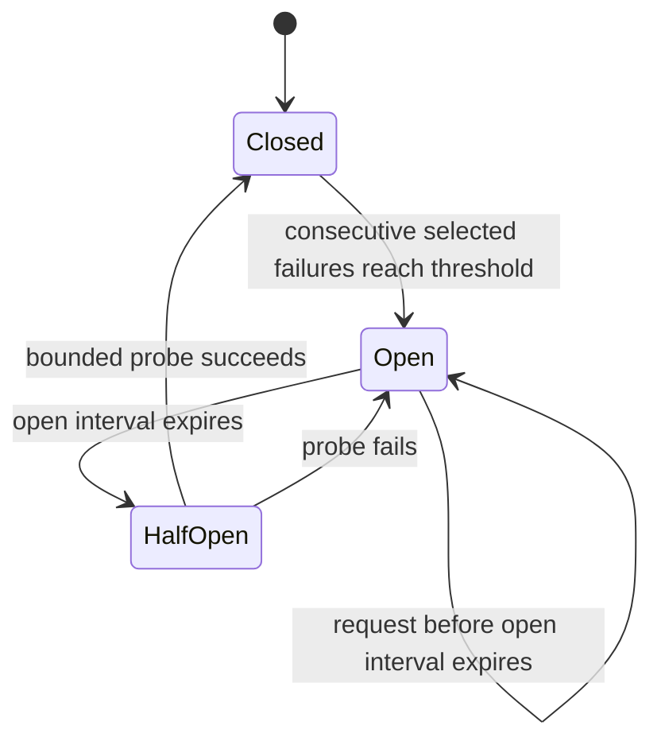

# Circuit breaker and Gateway rate limiting

## Scope

This stage closes two application-level reliability gaps without changing public routes, database schemas, message formats or Saga states:

- fail fast when a specific internal upstream operation is demonstrably unhealthy;
- bound request bursts before they consume downstream service capacity.

The implementation is intentionally process-local. Distributed circuit state, Redis-backed rate limiting and ingress-controller policies remain future work.

## Upstream circuit breakers

Each `resiliencehttp.Executor` owns independent breakers keyed by:

```text
<upstream>/<operation>
```

Examples:

```text
catalog-service/product-snapshot
identity-service/role-check
inventory-service/reserve
inventory-service/confirm
inventory-service/release
order-service/timeout-cancel
```

A failure in one operation therefore does not automatically block unrelated operations or another upstream.

### State machine



Default configuration:

| Setting | Default |
| --- | ---: |
| Consecutive failure threshold | 5 |
| Open interval | 5 seconds |
| Half-open concurrent probes | 1 |

Environment variables:

```text
HTTP_CIRCUIT_FAILURE_THRESHOLD
HTTP_CIRCUIT_OPEN_INTERVAL
HTTP_CIRCUIT_HALF_OPEN_MAX_PROBES
```

### Failure classification

The breaker counts the same infrastructure failures that are eligible for bounded retry:

- selected network or transport failures while the caller context is still valid;
- HTTP 502;
- HTTP 503;
- HTTP 504.

The breaker does not count:

- HTTP 4xx and domain validation failures;
- caller cancellation;
- caller deadline exhaustion;
- request-construction failures;
- ordinary non-retryable HTTP responses.

A permanent 4xx proves that the upstream was reached and processed the request, so it resets the closed-state failure streak rather than opening the circuit.

### Open-circuit behavior

An open circuit returns a typed `CircuitOpenError` before request construction or network I/O. The error unwraps to `ErrCircuitOpen` and includes:

- circuit key;
- retry-after duration.

The caller's remaining request budget is preserved because no HTTP attempt or retry sleep begins.

### Half-open behavior

After the open interval, the circuit changes to `half_open`. Only the configured number of probes can run concurrently. Additional callers fail fast with `ErrCircuitOpen`.

With the default single probe:

- success closes the circuit and resets the failure streak;
- failure reopens the circuit and restarts the open interval.

### Logs

State transitions are emitted as structured log records:

```text
circuit
from
to
```

Rejected calls also include:

```text
request_id
upstream
operation
attempt
outcome=circuit_open
remaining_budget_ms
error
```

## Gateway token-bucket rate limiting

The Gateway evaluates two token buckets before reverse proxying a business request:

1. a per-client bucket keyed by the direct TCP peer IP;
2. a global bucket protecting the Gateway process and all downstreams.

Both buckets must contain a token before the request is accepted. A rejected request consumes no downstream capacity and does not deduct a token from the other bucket.

### Defaults

| Setting | Default |
| --- | ---: |
| Per-client rate | 50 requests/second |
| Per-client burst | 100 requests |
| Global rate | 500 requests/second |
| Global burst | 1000 requests |
| Maximum client buckets | 10,000 |
| Inactive client TTL | 10 minutes |
| Cleanup interval | 1 minute |

Environment variables:

```text
GATEWAY_RATE_LIMIT_PER_CLIENT_RPS
GATEWAY_RATE_LIMIT_PER_CLIENT_BURST
GATEWAY_RATE_LIMIT_GLOBAL_RPS
GATEWAY_RATE_LIMIT_GLOBAL_BURST
GATEWAY_RATE_LIMIT_MAX_CLIENTS
GATEWAY_RATE_LIMIT_INACTIVE_TTL
GATEWAY_RATE_LIMIT_CLEANUP_INTERVAL
```

### Client identity

The initial implementation uses `http.Request.RemoteAddr` and removes the source port. It does not trust `X-Forwarded-For` because no trusted proxy boundary has been configured yet.

When an ingress or external load balancer is introduced, forwarded-header trust must be configured explicitly before using those headers for rate-limit identity.

### Health endpoints

`/live` and `/readyz` bypass rate limiting so orchestration health checks cannot be blocked by application traffic. `/ping` remains an ordinary public endpoint.

### Rejection contract

A rejected request receives:

```http
HTTP/1.1 429 Too Many Requests
Retry-After: <whole seconds>
X-Request-ID: <request id>
```

Body:

```json
{
  "code": "rate_limited",
  "message": "request rate limit exceeded",
  "request_id": "...",
  "retry_after": 1
}
```

### Memory boundary

Client buckets are stored in process memory. The limiter:

- removes buckets inactive beyond the configured TTL;
- performs cleanup at a bounded interval;
- evicts the least recently seen client when the configured maximum is reached.

This keeps state bounded, but limits are not shared between multiple Gateway replicas. Kubernetes or multi-instance deployment will require either an external limiter or ingress-level policy for cluster-wide enforcement.

## Rollback boundary

Circuit breaking is isolated in `internal/platform/resiliencehttp`; rate limiting is isolated in `internal/platform/ratelimit` and the Gateway admission path. Both can be disabled or reverted without changing:

- routes;
- database schemas;
- Outbox records;
- RabbitMQ messages;
- Order Saga state names.
