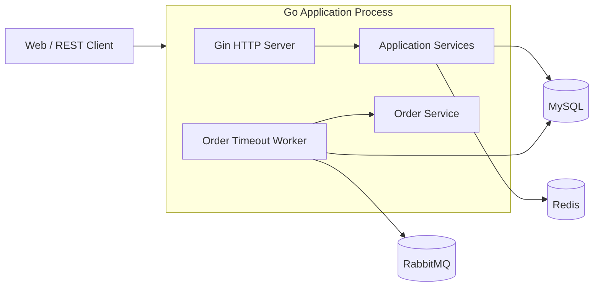

# 当前架构基线

> 本文只记录 `baseline-monolith-source-v1` 对应代码的真实状态，不代表目标架构。

## 1. 基线信息

- 源基线提交：`ef4c2f6d1d0e263e03e65909f43e30ac6a00c35a`
- 工作分支：`phase/00-baseline-hardening`
- 当前形态：工程化分层单体，HTTP API 与订单超时 Worker 同进程运行
- 部署单元：一个 Go 应用镜像，加 MySQL、Redis、RabbitMQ 和 migration 容器

## 2. 架构定性

当前项目不是“代码全部混在一起”的纠缠式单体，但也还不是严格的模块化单体。

其主要特征是：

1. 目录按技术层组织：`handler → service → dao → model`。
2. 商品、库存、订单、用户等业务边界已经能从类和接口中识别。
3. 不同业务模块仍直接共享 `*gorm.DB`、DAO 和数据库事务。
4. 订单创建事务同时操作商品、库存、库存流水、订单、幂等记录和 Outbox。
5. HTTP Server 与 RabbitMQ 超时 Worker 在同一进程、同一生命周期中启动和停止。

因此当前最准确的描述是：

> **具有明确技术分层和业务雏形的工程化单体，处于向模块化单体演进的前期。**

## 3. 当前运行单元

### 3.1 Go 应用进程

同一个进程内包含：

- Gin HTTP Server
- 用户、鉴权、商品、库存、库存流水、订单服务
- JWT TokenManager
- Redis 商品缓存适配器
- RabbitMQ Outbox 发布循环
- RabbitMQ 订单超时消费循环
- 信号监听和优雅关闭逻辑

### 3.2 MySQL

MySQL 是核心强依赖，用于：

- 用户与角色
- 商品
- 库存与库存流水
- 订单与订单项
- 订单幂等记录
- 订单超时 Outbox

应用启动阶段会建立数据库连接并执行 Ping。数据库不可用时应用启动失败。

### 3.3 Redis

Redis 当前只承担商品详情 cache-aside 缓存。

Redis 初始化失败时：

- 应用记录警告日志；
- 商品缓存被禁用；
- MySQL 主业务流程仍可继续运行。

因此 Redis 当前是可降级依赖。

### 3.4 RabbitMQ

RabbitMQ 用于待支付订单延迟取消：

- Outbox 发布器扫描数据库待发布事件；
- 消息进入 delay queue；
- TTL 到期后经 DLX 路由到 cancel queue；
- 消费者调用订单服务取消超时订单并回补库存；
- 无法处理的消息可进入 failed queue。

Worker 构造要求 RabbitMQ URL 和相关配置合法。当前应用把 Worker 作为启动依赖装配，HTTP API 与 Worker 尚未独立部署。

## 4. 技术分层

| 层 | 当前职责 | 主要目录 |
| --- | --- | --- |
| 启动与装配 | 配置加载、依赖创建、Server/Worker 生命周期 | `cmd/`、`internal/app/` |
| HTTP 路由 | 路由分组、认证和管理员权限中间件挂载 | `router/` |
| Handler | 参数绑定、调用 service、错误映射、统一响应 | `internal/handler/` |
| Service | 业务规则、状态机、事务控制、跨表操作 | `internal/service/` |
| DAO | GORM 查询、锁、条件更新和持久化 | `internal/dao/` |
| Model | 数据表映射和业务状态常量 | `internal/model/` |
| 平台能力 | JWT、缓存、日志中间件、数据库和 Redis 初始化 | `internal/auth/`、`internal/bizcache/`、`internal/middleware/`、`pkg/` |
| 异步任务 | Outbox 发布、RabbitMQ 拓扑、延迟消息消费 | `internal/ordertimeout/` |

## 5. 当前业务能力

### Identity

- 注册与登录
- bcrypt 密码哈希
- JWT 签发与校验
- 当前用户资料和密码修改
- `admin` / `user` 角色授权

### Catalog

- 商品创建
- 商品列表和详情
- 商品上下架
- 商品详情 Redis cache-aside

### Inventory

- 初始化库存
- 增加库存
- 查询库存
- 库存流水查询
- 行锁与条件更新

### Ordering

- 用户级幂等创建订单
- 商品上架状态检查
- 事务扣减库存
- 订单项和价格快照
- 库存流水
- 订单状态机
- 取消订单回补库存
- Outbox + RabbitMQ 延迟取消

## 6. 主要事务边界

### 6.1 用户注册事务

注册流程在一个本地 MySQL 事务中完成：

- 创建用户；
- 查询默认 `user` 角色；
- 建立用户角色关系。

### 6.2 库存变更事务

库存初始化或增加库存时，一个本地事务同时处理：

- 库存记录或库存数量；
- 对应库存流水。

### 6.3 创建订单事务

当前最重要的事务边界跨越多个业务概念：

1. 创建或读取订单幂等记录；
2. 创建订单主记录；
3. 读取并校验商品；
4. 对库存记录加行锁；
5. 条件扣减库存；
6. 创建订单项；
7. 写库存流水；
8. 更新订单总金额；
9. 完成幂等记录；
10. 写订单超时 Outbox。

任何一步失败都会回滚整个事务。这是当前一致性能力的核心，也是未来拆分 Order、Catalog 和 Inventory 时最大的约束。

### 6.4 取消订单事务

取消待支付订单时，一个本地事务处理：

- 条件更新订单状态；
- 锁定库存；
- 回补库存；
- 写取消回滚库存流水。

## 7. HTTP 与权限边界

公共接口：

- `POST /api/v1/auth/register`
- `POST /api/v1/auth/login`
- `/ping`
- `/live`
- `/readyz`

其余业务接口统一经过 JWT 中间件。

管理员权限用于：

- 创建和上下架商品；
- 初始化和增加库存；
- 查询库存流水。

订单接口依据当前 JWT 用户 ID 做数据隔离。

## 8. 健康检查与日志

### 健康检查

| 路径 | 当前含义 |
| --- | --- |
| `/ping` | HTTP 进程可响应 |
| `/live` | 进程存活 |
| `/readyz` | 当前只检查 MySQL Ping |

`/readyz` 当前没有检查 Redis、RabbitMQ、Outbox 积压或 Worker 会话状态。

### 日志

- 使用标准库 `slog`；
- 当前输出为 TextHandler；
- HTTP 中间件记录 Request ID、方法、路径、状态码、延迟、客户端 IP、响应大小和错误；
- Request ID 可从请求头继承或由服务生成，并写入响应头。

## 9. 工程化基线

当前仓库包含：

- 多阶段 Dockerfile；
- 非 root 容器用户；
- Docker Compose；
- MySQL、Redis、RabbitMQ 健康检查；
- Goose 迁移；
- Makefile；
- GitHub Actions；
- Go 单元和集成测试；
- race、vet、lint、build 检查；
- 服务优雅关闭。

## 10. 已知架构风险

### R1：业务边界没有形成代码级所有权

业务代码仍按技术层集中放置，任意 service 可以直接依赖共享 DAO 和 GORM DB。边界主要依靠开发者理解，而不是包依赖规则保证。

### R2：订单事务跨越多个未来服务候选域

当前强一致事务同时覆盖 Ordering、Catalog 和 Inventory 数据。直接拆服务会立即失去本地 ACID，需要库存预占、Saga 或补偿机制。

### R3：HTTP API 与 Worker 同进程

API 扩容会同时复制 Outbox 扫描器和消费者。当前 Outbox 查询没有租约字段、所有者字段或 `SKIP LOCKED`，多副本发布时存在重复投递和竞争风险。

### R4：启动依赖与就绪检查不一致

Redis 可以降级；RabbitMQ Worker 是应用装配的一部分；但 readiness 当前只检查 MySQL。探针无法完整表达 API 可用、异步能力降级或 Worker 失效的区别。

### R5：日志适合开发调试，但尚未形成服务化观测规范

当前日志已有 Request ID，但仍是文本输出，缺少统一的 service、environment、trace_id、order_id、event_id 等结构化字段规范。

### R6：配置和数据库命名存在漂移

CI、Compose、Makefile、环境变量示例和测试辅助代码曾出现连字符、下划线和旧数据库名混用。该问题应在架构重构前修复。

## 11. 尚未验证事项

以下内容不能从当前代码直接确定，需要后续测试或运行数据验证：

- 实际并发下单容量和 P95/P99 延迟；
- Outbox 高积压时的恢复速度；
- RabbitMQ 长时间不可用后的业务影响；
- API 多副本运行时 Outbox 重复发布的实际频率；
- Redis 缓存命中率；
- 数据库连接池在峰值负载下的配置是否合理；
- 当前前端构建和测试是否完整纳入根 CI；
- 线上备份、恢复和回滚时间目标。

## 12. 当前阶段结论

在进入微服务之前，当前项目应先完成：

1. CI 和数据库命名基线修复；
2. 重复可执行的 Compose smoke test；
3. 业务模块和数据所有权固化；
4. API 与 Worker 运行单元分离；
5. 可观测性基线。

这些工作不会改变现有业务目标，而是为后续安全拆分建立可验证边界。