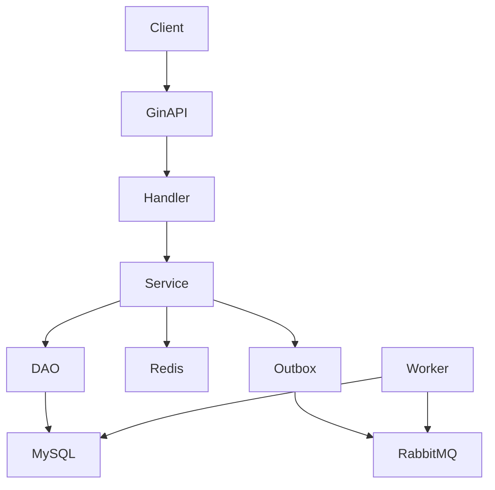

# 当前依赖关系图

## Runtime

## 当前模块

- User/Auth
- Product
- Inventory
- StockLog
- Order
- OrderTimeout Worker

## 当前风险

1. HTTP 层、业务层、数据层按照技术职责组织，业务边界没有完全隔离。
2. Order 创建流程直接依赖 Product 和 Inventory 数据访问。
3. Worker 与 API 在同一运行进程初始化。
4. 数据库是所有业务模块共享资源。

## 迁移约束

未来拆分必须先建立模块所有权，再考虑服务边界。