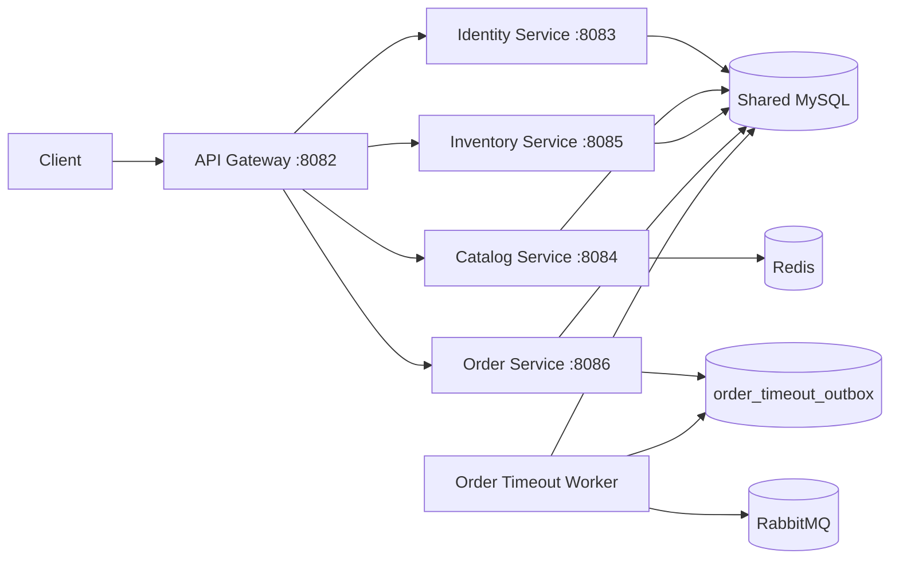

# 微服务架构 v1

## 目标

本版本将原先同一 Go 进程中的 HTTP API 和订单超时 Worker 拆成多个可独立构建、启动、健康检查和扩缩容的部署单元。

## 运行拓扑



## 服务职责

| 服务 | 当前职责 | 对外路径 |
| --- | --- | --- |
| `api-gateway` | 单一入口、路径路由、上游就绪检查 | 所有 `/api/v1/*` |
| `identity-service` | 注册、登录、JWT、用户资料与密码 | `/api/v1/auth/*`、`/api/v1/users/*` |
| `catalog-service` | 商品创建、查询、上下架、商品缓存 | `/api/v1/products/*` |
| `inventory-service` | 库存初始化、入库、库存查询、库存流水 | `/api/v1/inventory/*`、`/api/v1/stock-logs` |
| `order-service` | 创建订单、订单查询和订单状态流转 | `/api/v1/orders/*` |
| `order-timeout-worker` | Outbox 发布、RabbitMQ 延迟消息和超时取消 | 无 HTTP 入口 |

## 部署边界

每个服务拥有：

- 独立 `main` 包；
- 独立进程和容器镜像；
- 独立监听端口；
- 独立健康检查；
- 带 `service` 字段的 JSON 日志；
- 可单独重启和扩缩容的生命周期。

默认 `compose.yml` 已切换为该微服务拓扑，对宿主机只暴露 API Gateway 的 `8082` 端口。业务服务只在 Compose 网络中暴露。

## 路由规则

```text
/api/v1/auth/*        -> identity-service
/api/v1/users/*       -> identity-service
/api/v1/products/*    -> catalog-service
/api/v1/inventory/*   -> inventory-service
/api/v1/stock-logs*   -> inventory-service
/api/v1/orders/*      -> order-service
```

鉴权仍由目标业务服务执行。Gateway 保留并转发 `Authorization` 和 `X-Request-ID` 请求头。

## 当前一致性策略

### 已完成

- HTTP API 与订单超时 Worker 生命周期分离；
- 业务 HTTP 路由按 Identity、Catalog、Inventory、Ordering 拆成独立服务；
- 商品缓存只在 Catalog Service 初始化；
- RabbitMQ Publisher/Consumer 只在 Worker 进程运行；
- API Gateway 对全部上游进行 readiness 检查。

### 过渡性限制

微服务 v1 仍共享同一个 MySQL 数据库。这样做是为了在第一阶段保留现有创建订单和取消订单的本地事务：

- Order Service 仍直接读取 `products`；
- Order Service 仍直接锁定并修改 `product_inventories`；
- Ordering 与 Inventory 仍通过单数据库事务保证强一致；
- 各服务的管理员角色判断仍读取共享 Identity 表。

因此本版本是“独立部署单元已经拆分、数据所有权尚未完全物理隔离”的过渡微服务架构，不应被描述为最终完成态。

## 下一阶段

### Phase 2A：代码所有权隔离

- 将技术层目录迁移为 `identity`、`catalog`、`inventory`、`ordering` 模块；
- 禁止服务直接调用其他模块 DAO；
- 为服务间调用定义 DTO 和客户端接口。

### Phase 2B：Catalog 数据隔离

- Catalog Service 使用独立逻辑数据库；
- Order Service 通过 HTTP 获取商品有效性和价格快照；
- 订单表继续保存商品名称和价格快照。

### Phase 2C：Inventory 数据隔离

- 引入库存预占、确认和释放模型；
- Order Service 不再直接更新库存表；
- 使用 Saga/补偿和幂等事件处理替代跨域本地事务。

### Phase 2D：身份与授权隔离

- JWT 中增加必要的角色声明，或由 Gateway/Identity 提供授权判定；
- Catalog 和 Inventory 不再直接读取 Identity 表。

## 启动

```bash
cp .env.example .env
docker compose config
docker compose up -d --build --wait
curl http://127.0.0.1:8082/readyz
```

查看服务：

```bash
docker compose ps
docker compose logs -f api-gateway identity-service catalog-service inventory-service order-service order-timeout-worker
```
