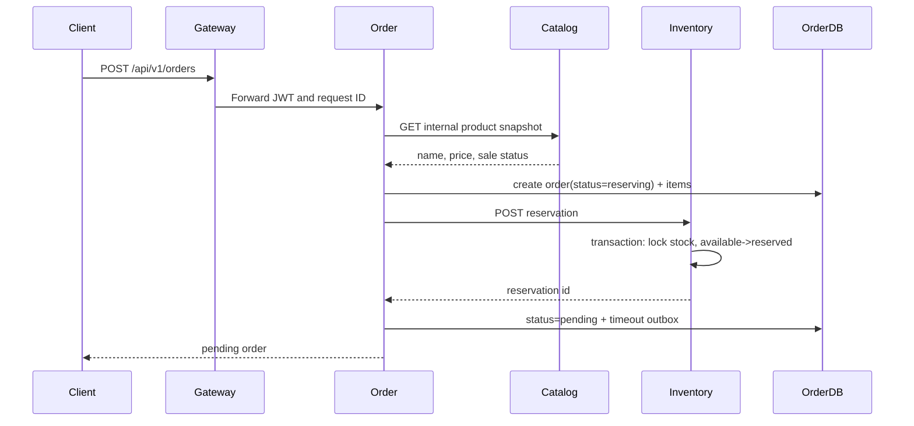

# Microservices v2: data ownership and order saga

## Status

This document describes the runtime introduced after `microservices-v1.md`.

Microservices v1 separated processes but retained one shared MySQL database. Microservices v2 establishes database ownership for the three domains that participate in order creation:

| Service | Database | Owned tables |
| --- | --- | --- |
| Identity Service | `go_order_identity` | legacy identity tables (`users`, `roles`, `user_roles`) |
| Catalog Service | `go_order_catalog` | `catalog_products` |
| Inventory Service | `go_order_inventory` | `inventory_items`, `inventory_reservations`, `inventory_reservation_items`, `inventory_stock_logs` |
| Order Service / Timeout Worker | `go_order_ordering` | `orders_v2`, `order_items_v2`, `order_timeout_outbox_v2` |

No Order Service transaction reads or writes Catalog or Inventory tables.

## Internal authentication

Service-to-service endpoints require the `X-Internal-Token` header. The value comes from `INTERNAL_SERVICE_TOKEN` and is never exposed through the API Gateway.

Internal calls are:

- Catalog and Inventory to Identity for administrator role checks.
- Order to Catalog for product snapshots.
- Order to Inventory for reservation, confirmation and release.
- Timeout Worker to Order for idempotent timeout cancellation.

The shared token is a migration-stage control. A later deployment should replace it with workload identity or mutually authenticated TLS.

## Order creation saga



If inventory reservation fails, the Order Service records the order as `failed`.

If the Order Service cannot finish its local transaction after inventory has been reserved, it calls Inventory release as compensation. If compensation also fails, the order is marked `reconciliation_required` instead of pretending the operation succeeded.

## Inventory reservation state machine

```text
pending -> confirmed
pending -> released
```

- `pending`: quantity moved from available stock to reserved stock.
- `confirmed`: reserved quantity is consumed after payment.
- `released`: reserved quantity returns to available stock after cancellation or timeout.

Confirm and release endpoints are idempotent for their existing final state. The opposite final transition is rejected.

## Order state machine

```text
reserving -> pending -> paying -> paid -> finished
                    \-> cancelling -> cancelled
reserving -> failed
any uncertain cross-service completion -> reconciliation_required
```

Conditional database updates ensure that payment and cancellation cannot both win from the same `pending` order state.

## Timeout outbox

Order creation writes `order_timeout_outbox_v2` in the Order database after the reservation succeeds.

The standalone worker:

1. polls pending outbox records;
2. publishes persistent RabbitMQ delay messages;
3. marks records as published;
4. consumes the dead-lettered timeout messages;
5. calls the Order Service timeout-cancel endpoint;
6. marks the outbox record completed.

Timeout cancellation is idempotent. A paid, cancelled or otherwise non-pending order is treated as already resolved.

## Deliberate migration constraints

- Identity still runs the original Goose migrations in its own database. The extra legacy tables in that database are transitional and are not accessed by Catalog, Inventory or Order.
- Catalog, Inventory and Order currently run GORM `AutoMigrate` for their owned v2 tables. Dedicated versioned migrations should replace this before a production deployment.
- Internal calls use synchronous HTTP/JSON. Retries, circuit breaking and trace propagation beyond the existing request ID remain future work.
- The outbox publisher currently assumes one active worker replica. A lease/claim mechanism is required before horizontal worker scaling.

## Verification

The CI pipeline must pass all of the following before merging:

- lint;
- unit and integration tests;
- race detector;
- vet;
- all service binary builds;
- Compose validation;
- all service image builds;
- startup of the four-database Compose topology;
- API Gateway readiness.
