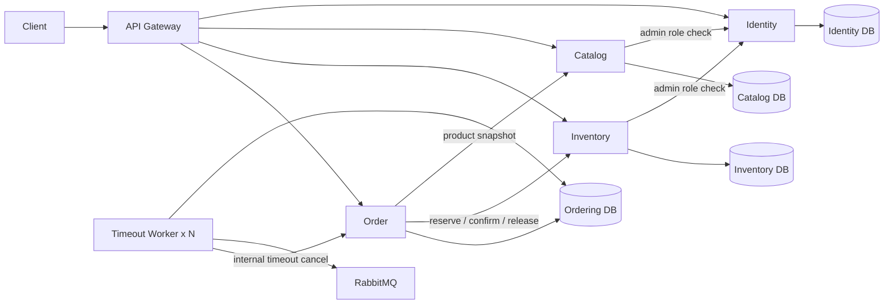
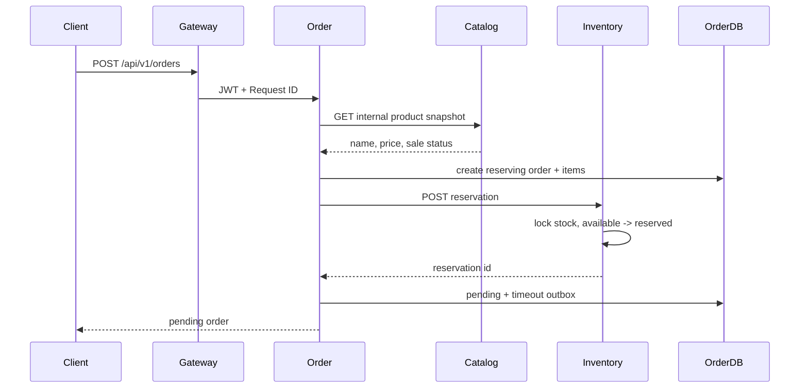

# Microservices v2：数据所有权与订单 Saga

## 1. 当前状态

本文描述 `main` 当前运行的微服务数据边界和订单一致性机制。

项目已经从“多进程但共享数据库”的 Microservices v1 演进为：

- API Gateway；
- Identity、Catalog、Inventory、Order 四个业务服务；
- 独立订单超时 Worker；
- 四个服务独立数据库；
- 服务间 HTTP/JSON 调用；
- 库存预占与订单 Saga；
- RabbitMQ + Transactional Outbox；
- 多 Worker 租约抢占；
- 服务独立 Goose 迁移。

## 2. 服务与数据所有权

| 服务 | 数据库 | 所有表 |
| --- | --- | --- |
| Identity Service | `go_order_identity` | `users`、`roles`、`user_roles` |
| Catalog Service | `go_order_catalog` | `catalog_products` |
| Inventory Service | `go_order_inventory` | `inventory_items`、`inventory_reservations`、`inventory_reservation_items`、`inventory_stock_logs` |
| Order Service / Timeout Worker | `go_order_ordering` | `orders_v2`、`order_items_v2`、`order_timeout_outbox_v2` |

核心约束：

1. Order Service 不读取或修改 Catalog、Inventory 数据表。
2. Catalog 和 Inventory 不读取 Identity 数据表。
3. 服务跨域协作必须通过内部 HTTP API。
4. 每个服务只对自己的数据库执行读写。
5. Schema 由独立 Goose Job 管理，业务进程不执行 `AutoMigrate`。

## 3. 运行拓扑



## 4. 内部服务认证

内部接口要求：

```http
X-Internal-Token: <INTERNAL_SERVICE_TOKEN>
```

当前内部调用：

- Catalog → Identity：检查管理员角色；
- Inventory → Identity：检查管理员角色；
- Order → Catalog：读取商品名称、价格和上架状态快照；
- Order → Inventory：预占、确认或释放库存；
- Timeout Worker → Order：执行幂等超时取消。

共享静态 Token 是实验阶段方案。生产环境应替换为 mTLS、ServiceAccount、Workload Identity 或短期服务凭证。

## 5. 创建订单 Saga



### 5.1 失败与补偿

| 失败位置 | 处理方式 |
| --- | --- |
| 商品不存在或未上架 | 不创建有效订单，返回商品不可用 |
| 创建初始订单失败 | 本地事务回滚 |
| 库存预占失败 | 订单更新为 `failed` |
| 预占成功，但订单完成事务失败 | 调用 Inventory 释放预占 |
| 释放补偿也失败 | 订单更新为 `reconciliation_required` |

`reconciliation_required` 表示跨服务结果不确定，需要后续对账处理，不能将其伪装成普通失败。

## 6. 库存预占状态机

```text
pending -> confirmed
pending -> released
```

- `pending`：库存从 available 转移到 reserved；
- `confirmed`：支付成功，预占库存被正式消耗；
- `released`：主动取消或超时取消，库存回到 available。

确认和释放对已有最终状态保持幂等；相反方向的最终转换会被拒绝。

## 7. 订单状态机

```text
reserving -> pending -> paying -> paid -> finished
                    \-> cancelling -> cancelled
reserving -> failed
uncertain cross-service result -> reconciliation_required
```

支付和取消使用条件更新竞争同一个 `pending` 状态，保证两者不能同时成功。

## 8. 超时 Outbox

订单进入 `pending` 时，在 Ordering 本地事务内写入 `order_timeout_outbox_v2`。

Worker 流程：

1. 从 Ordering DB 抢占待发布 Outbox；
2. 发布 RabbitMQ 持久化延迟消息；
3. 更新 Outbox 为 `published`；
4. 消费 TTL/DLX 转发后的取消消息；
5. 调用 Order Service 内部超时取消接口；
6. Order Service 释放 Inventory 预占；
7. Worker 将 Outbox 更新为 `completed`。

超时取消接口具有幂等性。已支付、已取消或其他非 `pending` 状态视为已经解决。

## 9. 多 Worker 租约

Outbox 表包含：

```text
lease_owner
lease_until
next_attempt_at
```

Worker 使用 `FOR UPDATE SKIP LOCKED` 抢占批次：

```sql
SELECT ...
FROM order_timeout_outbox_v2
WHERE status IN ('pending', 'failed')
  AND next_attempt_at <= NOW(3)
  AND (lease_until IS NULL OR lease_until < NOW(3))
ORDER BY id
LIMIT ?
FOR UPDATE SKIP LOCKED;
```

特性：

- 活跃租约期间，其他 Worker 不会领取同一事件；
- Worker 崩溃后，租约过期的事件可以重新领取；
- 发布失败会清除租约并设置下一次重试时间；
- Compose 和 CI 已验证两个 Worker 副本同时启动。

当前仍是 at-least-once 语义。Publisher Confirms 尚未启用，因此 broker 已接收消息但数据库更新前崩溃时，可能重复发布。

## 10. 数据库迁移

```text
migrations/identity
migrations/catalog
migrations/inventory
migrations/ordering
```

Compose 使用四个一次性 Migration Job。业务服务依赖所属迁移 Job 成功完成后启动。

当前迁移 Job 和业务服务仍使用 MySQL root 凭证；生产环境应拆分为：

- migration account：允许 DDL；
- runtime account：仅允许本服务数据库的必要 DML。

## 11. 当前验证

GitHub Actions 已验证：

- lint、unit/integration tests、race、vet 和 build；
- 四个服务迁移目录 validate；
- 所有服务镜像构建；
- 四数据库 Compose 拓扑启动；
- 两个 Timeout Worker 副本；
- Gateway readiness；
- 注册、商品、库存、幂等下单、支付、主动取消和 RabbitMQ 超时补偿完整链路。

## 12. 剩余限制

- Publisher Confirms 尚未接入；
- 内部认证仍是共享静态 Token；
- HTTP 客户端缺少统一的重试、熔断、限流和隔离策略；
- 缺少 Prometheus、Grafana、OpenTelemetry 和告警；
- `reconciliation_required` 尚无自动对账任务；
- 尚未提供 Kubernetes 资源和持续部署流水线；
- 尚未完成备份恢复、压测和故障演练。
