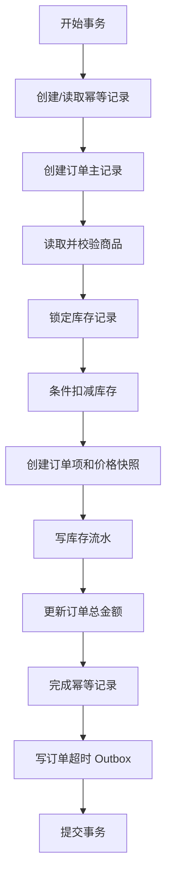
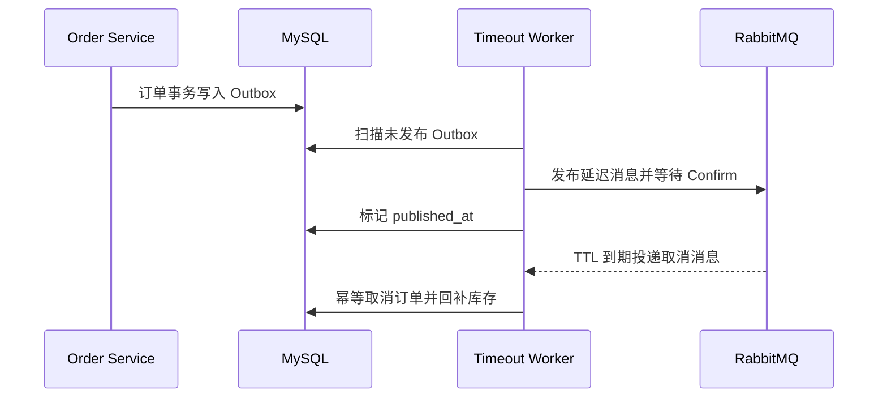

# 当前事务边界与拆分约束

> 本文记录基线提交 `ef4c2f6d1d0e263e03e65909f43e30ac6a00c35a` 的真实事务行为。本文不是目标微服务设计。

## 1. 为什么先记录事务边界

当前系统依靠单个 MySQL 数据库提供本地 ACID。微服务拆分一旦把参与同一事务的表放入不同服务或不同数据库，原事务将不再存在。因此，事务边界是判断“能否直接拆分”的首要依据。

## 2. 事务清单

| 编号 | 业务操作 | 主要数据 | 当前一致性方式 | 拆分敏感度 |
| --- | --- | --- | --- | --- |
| T1 | 用户注册 | `users`、`roles`、`user_roles` | 本地 MySQL 事务 | 低 |
| T2 | 初始化库存 | `product_inventories`、`stock_logs` | 本地 MySQL 事务 | 中 |
| T3 | 增加库存 | `product_inventories`、`stock_logs` | 行锁/条件更新 + 本地事务 | 中 |
| T4 | 创建订单 | 商品、库存、订单、订单项、幂等、库存流水、Outbox | 行锁 + 条件更新 + 单库事务 | 极高 |
| T5 | 主动取消订单 | 订单、库存、库存流水 | 条件状态更新 + 行锁 + 单库事务 | 高 |
| T6 | 超时取消订单 | Outbox/RabbitMQ 事件、订单、库存、库存流水 | 至少一次消息 + 幂等业务处理 + 本地事务 | 高 |
| T7 | 支付/完成订单 | `orders` | 条件状态更新 | 低 |

## 3. T1：用户注册事务

当前事务目标：用户、默认角色和用户角色关系必须同时成功。

```text
BEGIN
  INSERT users
  SELECT default user role
  INSERT user_roles
COMMIT
```

拆分约束：

- Identity 内部可以继续保持本地事务。
- 不需要为了学习微服务而提前拆分 `roles` 与 `users`。
- 若未来角色由独立权限平台管理，需要明确注册失败补偿或默认角色预置策略。

## 4. T2/T3：库存初始化与增加库存

当前事务目标：库存事实和库存流水必须一致。

```text
BEGIN
  LOCK / CREATE product_inventories
  UPDATE stock_quantity
  INSERT stock_logs
COMMIT
```

约束：

- `product_inventories` 是库存事实表。
- `stock_logs` 是审计记录，不能替代库存事实。
- Inventory 模块应同时拥有这两张表。
- 拆分 Catalog 时，不应把库存表一并放入 Catalog Service。

## 5. T4：创建订单事务

这是当前最重要、最不可直接跨服务复制的事务。



当前保证：

- 同一用户的相同幂等 Key 不会重复创建订单。
- 商品必须存在且处于上架状态。
- 库存通过行锁和条件更新避免负数。
- 订单、订单项、扣库存、库存流水、幂等完成状态和 Outbox 同时提交。
- 任一步失败，全部回滚。

直接拆分后的问题：

| 拆分动作 | 失去的能力 |
| --- | --- |
| Catalog 独立数据库 | 订单事务不能直接读取商品表 |
| Inventory 独立数据库 | 订单事务不能原子扣减库存 |
| Order 独立数据库 | 订单与库存无法同事务提交 |
| Outbox 独立存储 | 订单提交与事件创建无法原子完成 |

因此：

- Catalog 可以先拆，但订单只应通过稳定契约读取下单所需商品快照。
- Inventory 在引入库存预占模型之前不应独立拆出。
- Ordering 与 Inventory 的最终拆分需要 Saga/补偿，而不是分布式数据库事务。

## 6. T5：主动取消订单事务

当前事务目标：订单状态与库存回补必须一致。

```text
BEGIN
  条件更新 pending -> cancelled
  锁定商品库存
  回补库存
  写取消库存流水
COMMIT
```

拆分后至少需要：

- 幂等取消命令；
- Inventory `Release` 接口；
- 取消失败重试；
- 重复 Release 防护；
- Order 与 Inventory 状态不一致的对账/修复机制。

## 7. T6：超时取消订单

当前链路：



当前语义：

- Outbox 保证订单提交后存在可重试的发布记录。
- Publisher Confirm 成功后才标记已发布。
- 消费端必须按至少一次投递语义设计。
- 订单状态条件更新承担业务幂等的一部分。

已知限制：

- Outbox 扫描没有租约、处理者字段或 `SKIP LOCKED`。
- API 与 Worker 同进程，多副本部署会同时复制扫描器和消费者。
- readiness 只检查 MySQL，不能表达 Worker/RabbitMQ 能力状态。

## 8. 当前可安全拆分与不可安全拆分

### 可优先进行

1. HTTP API 与订单超时 Worker 拆成独立进程。
2. Catalog 模块代码边界重构。
3. Catalog Service 作为第一个业务服务实验，但仍需明确下单契约和失败策略。

### 暂不直接进行

1. Inventory Service 独立数据库。
2. Order Service 与 Inventory Service 同时拆分。
3. 使用远程 HTTP 调用直接替换当前事务内 DAO 调用。
4. 通过无限重试掩盖跨服务一致性问题。

## 9. 进入 Inventory 拆分前的前置条件

必须先具备：

- 库存预占实体或记录；
- `Reserve`、`Confirm`、`Release` 操作；
- 每个操作的业务幂等 Key；
- 预占超时释放；
- 消息重复和乱序处理规则；
- 失败补偿和人工对账路径；
- 可观测指标：预占成功率、释放失败数、过期预占数、状态不一致数。

## 10. 结论

当前单体最有价值的能力正是订单与库存的本地强一致性。微服务改造不应简单地把 DAO 调用换成 HTTP 调用，而应先模块化、分离运行进程，再逐步为跨服务一致性建立明确协议。