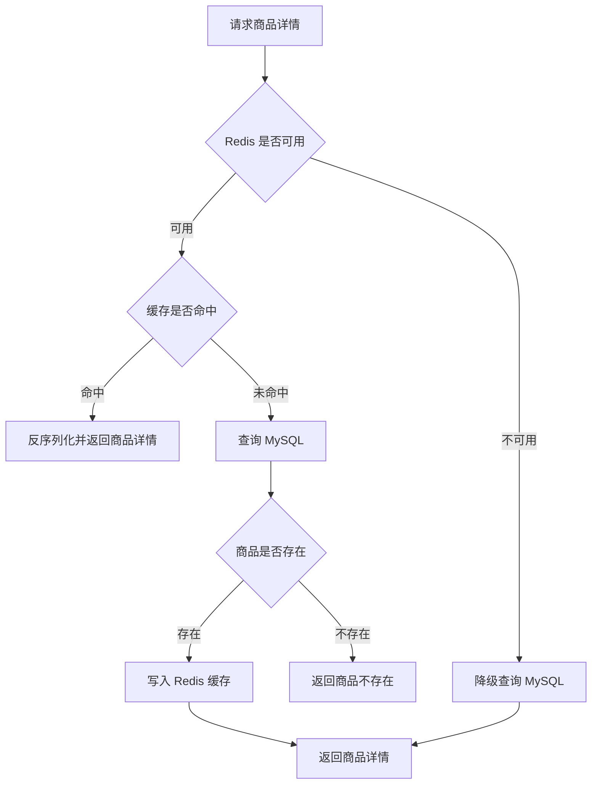

# Redis 商品详情缓存设计

本文说明当前项目的 Redis 使用范围、cache-aside 查询流程、缓存失效策略、降级策略和后续演进方向。

## 1. 缓存目标

当前项目只对商品详情接口使用 Redis 缓存，目标是：

- 减少热点商品详情对 MySQL 的重复查询。
- 保持商品查询链路简单可控。
- Redis 不可用时不影响主业务流程。
- 通过商品上下架删除缓存，避免状态变化后继续读取旧数据。

当前项目没有把订单、库存、用户信息放入缓存。原因是这些数据对一致性要求更高，且当前阶段的重点是订单事务与库存一致性，而不是复杂缓存体系。

## 2. 缓存范围

| 接口/数据 | 是否缓存 | 原因 |
| --- | --- | --- |
| 商品详情 | 是 | 读多写少，适合 cache-aside |
| 商品列表 | 否 | 当前列表语义简单，后续可按筛选条件扩展 |
| 库存 | 否 | 库存强一致要求更高，当前直接走 MySQL 事务和行锁 |
| 订单 | 否 | 订单属于用户私有数据，状态变化频繁，当前直接查 MySQL 更简单可靠 |
| 用户资料 | 否 | 当前访问量低，暂不引入缓存复杂度 |

## 3. 缓存 Key 设计

商品详情缓存 Key：

```text
product:detail:{product_id}
```

示例：

```text
product:detail:1001
```

Key 设计原则：

- 语义清晰，能直接看出数据类型和业务 ID。
- 与商品详情一一对应，便于商品状态变化时精准删除。
- 不把用户信息放入商品详情缓存，因为商品详情是公共商品数据。

## 4. Cache-aside 查询流程



## 5. 缓存失效策略

当前项目在商品状态变化时主动删除商品详情缓存：

- 商品上架：删除 `product:detail:{product_id}`。
- 商品下架：删除 `product:detail:{product_id}`。

这样做的原因：

- 上架/下架会影响商品是否可购买。
- 商品状态变化后，继续使用旧缓存可能导致前端看到错误状态。
- 删除缓存比更新缓存更简单，下一次查询时重新从 MySQL 加载即可。

## 6. Redis 异常降级

当前设计中，Redis 是性能优化，不是主流程依赖。

当 Redis 初始化失败、读取失败或写入失败时：

- 查询商品详情仍然走 MySQL。
- 不因为 Redis 失败导致商品详情接口不可用。
- 主业务链路优先保证正确性和可用性。

这种设计适合求职项目展示，因为它体现了一个重要后端原则：**缓存是加速层，不应该轻易成为核心业务的单点故障。**

## 7. 当前边界

当前缓存设计是基础版 cache-aside，暂不包含：

- 缓存击穿保护。
- 缓存穿透保护。
- 延迟双删。
- 本地缓存。
- 分布式锁。
- 商品列表缓存。
- 库存缓存。

这些不是当前阶段必须实现的内容。对于本项目来说，优先级应该是：先把事务、幂等、状态机、测试和工程化做清楚，再按需要补充缓存增强策略。

## 8. 后续演进方向

后续可以逐步增加：

1. **缓存 TTL**：为商品详情设置过期时间，避免长期脏数据。
2. **缓存空值**：对不存在商品短时间缓存空结果，降低穿透风险。
3. **互斥重建**：热点 Key 失效时避免大量请求同时打到 MySQL。
4. **商品列表缓存**：按状态、分页和筛选条件生成列表缓存 Key。
5. **缓存指标**：统计命中率、未命中率和 Redis 错误次数。
6. **结构化日志**：记录缓存命中、未命中、删除和降级事件。
