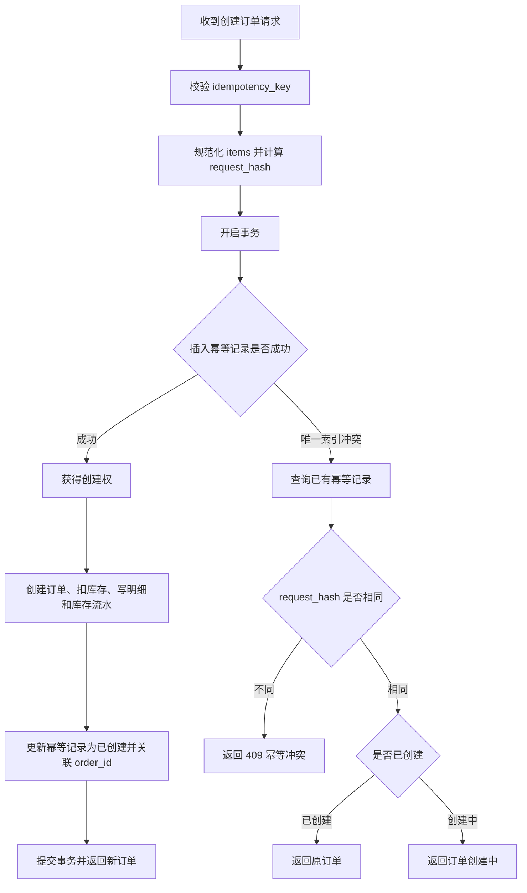

# 订单创建幂等设计

本文说明订单创建接口为什么需要幂等、当前项目如何实现用户级幂等、请求摘要如何计算，以及不同场景下应该返回什么结果。

## 1. 为什么订单创建需要幂等

订单创建属于高风险写接口。客户端可能因为以下原因重复请求：

- 用户重复点击“提交订单”。
- 网络超时后客户端自动重试。
- 网关或前端请求重放。
- 用户刷新页面后再次提交相同请求。

如果没有幂等控制，可能导致：

- 同一个用户创建多笔重复订单。
- 同一批商品被重复扣库存。
- 库存流水出现多条重复扣减记录。
- 用户和客服无法判断哪一笔订单才是真实意图。

## 2. 当前实现目标

当前项目的幂等粒度是：**用户级订单创建幂等**。

也就是说：

- 同一用户、同一 `idempotency_key`、相同请求内容：返回同一笔订单。
- 同一用户、同一 `idempotency_key`、不同请求内容：返回幂等冲突。
- 不同用户可以安全使用相同 `idempotency_key`。

## 3. 表设计

幂等记录表：`order_idempotency_keys`

核心字段：

| 字段 | 作用 |
| --- | --- |
| `user_id` | 绑定当前登录用户，保证幂等 Key 只在用户维度内唯一 |
| `idempotency_key` | 客户端提交的幂等 Key |
| `request_hash` | 服务端根据规范化请求内容计算出的摘要 |
| `order_id` | 创建成功后关联的订单 ID |
| `status` | 幂等记录状态，区分创建中和已创建 |

核心唯一索引：

```sql
UNIQUE KEY uk_user_idempotency_key (user_id, idempotency_key)
```

这个索引用于仲裁并发请求：同一个用户使用同一个 Key 并发请求时，数据库只允许一个请求抢占创建权。

## 4. 请求摘要设计

客户端请求示例：

```json
{
  "idempotency_key": "order-create-20260703-001",
  "items": [
    {
      "product_id": 1,
      "quantity": 2
    }
  ]
}
```

服务端不会直接使用原始 JSON 字符串计算摘要，而是先做规范化处理：

1. 提取订单商品项。
2. 按 `product_id` 和 `quantity` 排序，避免数组顺序导致摘要不同。
3. 只保留影响订单语义的字段。
4. 加入摘要版本号，方便后续升级摘要规则。
5. 序列化后计算 SHA-256。

这样可以避免同一语义请求因为 JSON 字段顺序或 items 顺序不同而被误判为不同请求。

## 5. 处理流程



## 6. 场景规则

| 场景 | 结果 |
| --- | --- |
| 首次请求 | 创建订单，扣减库存，写入库存流水，返回新订单 |
| 相同 Key + 相同请求 | 返回原订单，不重复扣库存 |
| 相同 Key + 不同请求 | 返回幂等冲突 |
| 不同用户 + 相同 Key | 可以分别创建自己的订单 |
| 首次请求中途失败 | 事务回滚，幂等记录也回滚，客户端可用原 Key 重试 |
| 多个并发请求使用同一 Key | 只有一个请求创建订单，其余请求返回原订单或创建中状态 |

## 7. 为什么要绑定 user_id

如果只对 `idempotency_key` 做全局唯一，会出现两个问题：

1. 不同用户可能使用相同 Key，导致互相冲突。
2. 攻击者可能猜测或构造 Key 干扰其他用户请求。

因此当前项目使用 `(user_id, idempotency_key)` 作为唯一约束，让幂等控制只在当前用户范围内生效。

## 8. 为什么要保存 request_hash

只保存 `idempotency_key` 不够。因为同一个用户可能错误地复用同一个 Key 提交了不同订单内容。

例如：

- 第一次：商品 1，数量 1。
- 第二次：商品 2，数量 3。
- 两次使用相同 `idempotency_key`。

如果不校验请求摘要，第二次请求可能错误返回第一次订单，导致客户端和用户看到的结果与实际提交内容不一致。

因此当前项目保存 `request_hash`，用于判断 Key 是否被不同语义的请求复用。

## 9. 当前边界

当前实现只对“创建订单”做请求级幂等。

以下接口暂时不要求客户端提交幂等 Key：

- 支付订单
- 完成订单
- 取消订单
- 增加库存

其中支付、完成、取消依赖订单状态机处理重复调用。例如已取消订单再次取消，可以按业务幂等直接返回；已支付订单再次支付，则由状态规则决定返回结果。