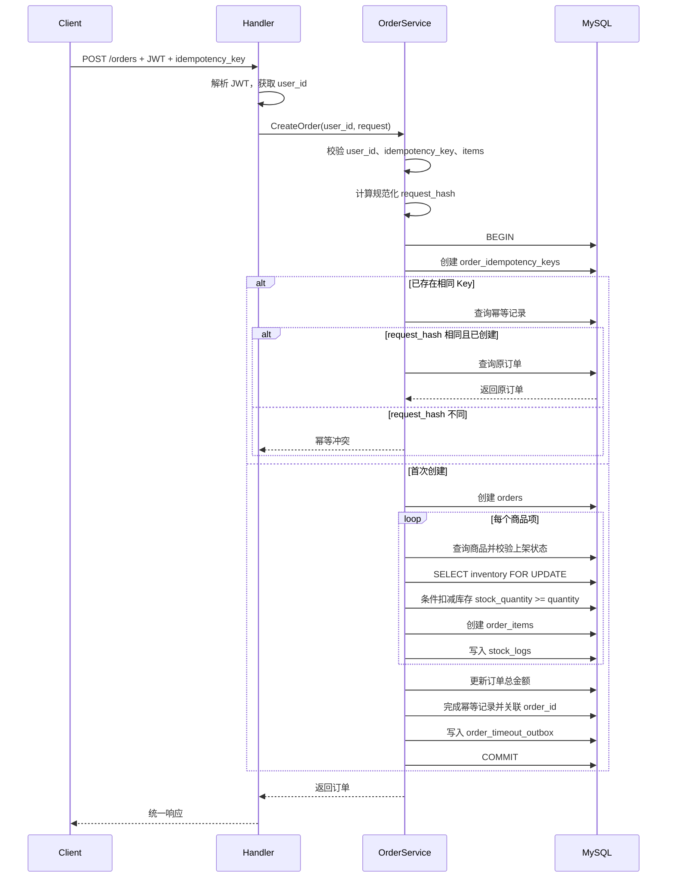
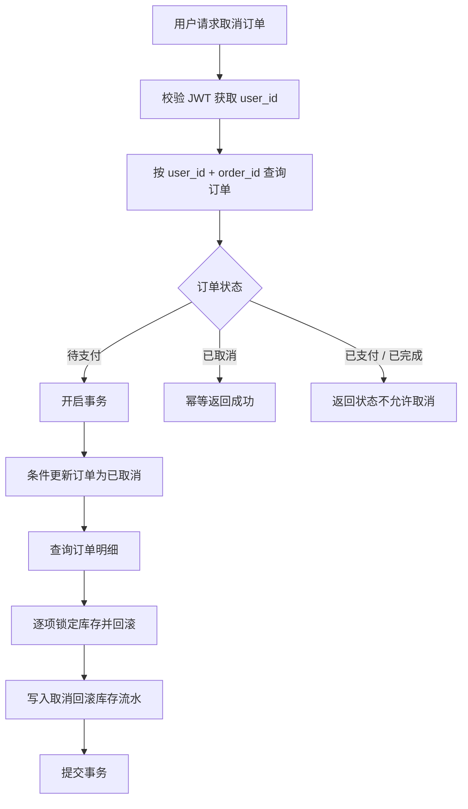
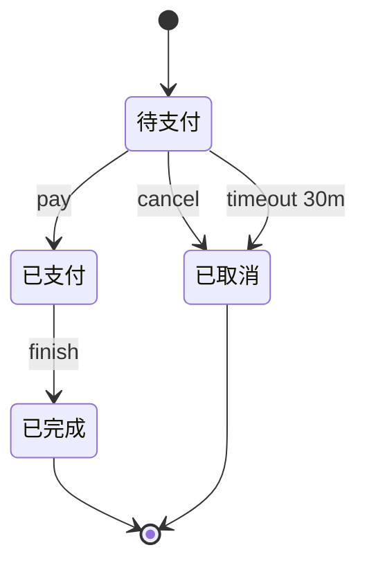
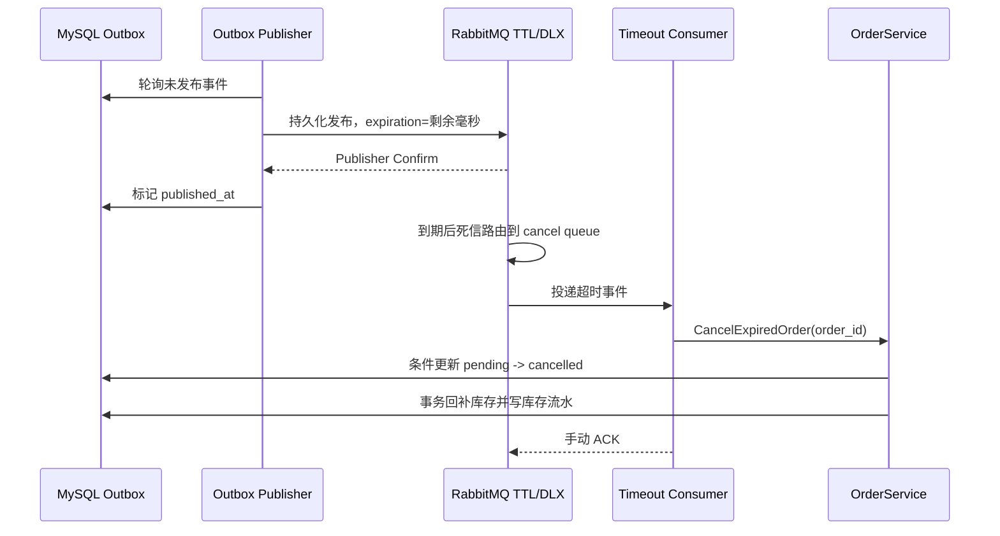

# 订单创建与状态流转设计

本文说明订单主链路的业务流程、事务边界、库存扣减方式和订单状态流转规则，用于项目复盘、README 展示和面试讲解。

## 1. 设计目标

订单模块不是简单 CRUD，核心目标是保证以下问题可控：

- 创建订单时，订单、订单项、库存、库存流水和幂等记录保持一致。
- 并发下单时，库存不能被扣成负数。
- 用户重复提交同一订单请求时，不能重复创建订单或重复扣库存。
- 用户只能查询和操作自己的订单。
- 订单状态只能按业务规则流转，不能随意修改。
- 待支付订单超过 30 分钟后自动取消并释放库存。

## 2. 创建订单流程



## 3. 事务边界

创建订单时，以下操作必须在同一个数据库事务中完成：

1. 创建或检查订单幂等记录。
2. 创建订单主表记录。
3. 查询商品并校验商品状态。
4. 锁定库存记录。
5. 扣减库存。
6. 创建订单明细。
7. 写入库存流水。
8. 更新订单总金额。
9. 更新幂等记录为已创建并关联订单 ID。
10. 写入订单超时 Outbox，截止时间为订单创建时间加 30 分钟。

这样可以避免以下不一致状态：

- 订单创建成功，但库存没有扣减。
- 库存扣减成功，但订单创建失败。
- 订单明细写入了一部分，但后续商品库存不足。
- 幂等记录存在，但没有关联有效订单。
- 库存变化没有流水记录，后续无法排查。

## 4. 并发库存扣减设计

创建订单时，库存扣减同时使用两层保护：

### 4.1 行锁读取库存

通过 `SELECT ... FOR UPDATE` 锁定当前商品的库存记录，保证同一事务内看到的库存变化具有排他性。

适合解决：

- 需要记录扣减前库存 `before_quantity`。
- 需要计算扣减后库存 `after_quantity`。
- 需要写入完整库存流水。

### 4.2 条件扣减库存

实际扣减时使用类似以下条件：

```sql
UPDATE product_inventories
SET stock_quantity = stock_quantity - ?
WHERE product_id = ? AND stock_quantity >= ?;
```

如果 `RowsAffected = 0`，说明库存不足或并发条件下库存已被其他事务扣减，当前请求应返回库存不足并回滚事务。

## 5. 取消订单流程

订单取消只允许对待支付订单执行。



取消订单时需要回滚库存并写入 `biz_type = 4` 的库存流水。这样可以保证库存变化有完整来源记录。

## 6. 订单状态机

当前订单状态：

| 状态值 | 状态名称 | 说明 |
| --- | --- | --- |
| 1 | 待支付 | 订单已创建，库存已扣减，等待支付 |
| 2 | 已支付 | 订单已支付，不能再取消 |
| 3 | 已完成 | 订单履约完成，终态 |
| 4 | 已取消 | 订单取消，库存已回滚，终态 |

允许的状态流转：



禁止的状态流转：

- 已支付订单不能取消。
- 已完成订单不能取消。
- 已取消订单不能支付或完成。
- 待支付订单不能直接完成。
- 已完成订单不能回退到已支付。

## 7. RabbitMQ 超时取消链路



RabbitMQ 不可用时订单创建不受影响，事件保留在 Outbox 中等待重试。发布确认前不会标记已发布；消费者处理成功前不会 ACK。重复发布或重复消费不会重复回补库存。

## 8. 用户数据隔离

订单相关读写必须绑定当前登录用户：

- 查询订单详情：`WHERE user_id = ? AND id = ?`
- 查询订单列表：`WHERE user_id = ?`
- 更新订单状态：`WHERE user_id = ? AND id = ? AND status = ?`

这样做的目的：

- 防止用户通过猜测订单 ID 访问其他用户订单。
- 防止用户修改其他用户订单状态。
- 面向后续多租户或权限模型时，保留清晰扩展点。
